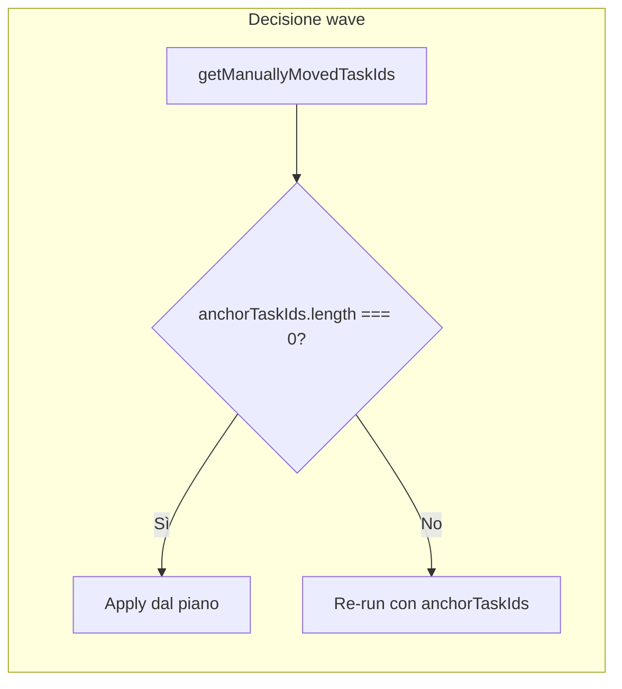

# Piano: anchor da campo `manually_moved` (sostituzione logica diff)

## Obiettivo

- **Anchor:** solo i task con `manually_moved = true` in `daily_assignments_current` sono fissi per le wave successive; il flag non viene mai azzerato.
- **Rimozione:** eliminare `compareTimelineWithPlan`, il confronto timeline vs piano e l'uso di diff/samePriorityOnTimeline per decidere re-run.
- **Spostamenti manuali:** solo D&D utente (move tra cleaner, swap tra cleaner da UI, drag da container a timeline, reorder stesso cleaner). **Non** gli swap/relocations eseguiti da fase 4 e 5 (scrivono su `optimizer_assignment`; la timeline viene aggiornata solo in apply/sync, senza impostare `manually_moved`).

---

## 1. Schema e persistenza di `manually_moved`

- **Tabella:** [scripts/create-pg-table.ts](scripts/create-pg-table.ts) (riferimento struttura). La tabella `daily_assignments_current` non ha oggi la colonna.
- **Azione:** aggiungere colonna `manually_moved BOOLEAN NOT NULL DEFAULT false` a `daily_assignments_current`.
  - Creare uno script di migrazione (es. `scripts/add-manually-moved-column.ts`) che fa `ALTER TABLE daily_assignments_current ADD COLUMN IF NOT EXISTS manually_moved BOOLEAN NOT NULL DEFAULT false;` (stile [scripts/add-task-collaborators.ts](scripts/add-task-collaborators.ts) / [scripts/add-cleaner-fields.ts](scripts/add-cleaner-fields.ts)).
- **Service:** in [server/services/pg-daily-assignments-service.ts](server/services/pg-daily-assignments-service.ts):
  - Estendere `PgDailyAssignmentRow` con `manually_moved?: boolean`.
  - In `timelineToRows`: impostare `row.manually_moved = Boolean(task.manually_moved)` (default `false` se assente).
  - In `saveTimeline`: includere `manually_moved` nella lista colonne e nei valori dell'INSERT.
  - Nella lettura (metodo che costruisce timeline da righe DB, ~linee 538–605): da ogni `row` impostare `task.manually_moved = row.manually_moved === true`.

Così tutto ciò che passa da `saveTimeline` (D&D e reorder) persiste e ricarica `manually_moved`.

---

## 2. Dove impostare `manually_moved = true` (solo azioni utente)

In [server/routes.ts](server/routes.ts), prima di chiamare `workspaceFiles.saveTimeline`, impostare `task.manually_moved = true` sugli oggetti task coinvolti:

| Endpoint / azione | Cosa marcare |
|-------------------|--------------|
| **POST /api/move-task-between-cleaners** | `taskToMove.manually_moved = true` (oltre a `reasons` già presenti ~676–682). |
| **POST /api/swap-cleaners-tasks** | Per ogni task in `sourceEntry.tasks` e `destEntry.tasks` dopo lo swap: `task.manually_moved = true` (in aggiunta a `markTasksAsManual` che setta `reasons` ~887–902). |
| **Assegnazione da container a timeline** (flusso che costruisce `taskForTimeline` e poi chiama saveTimeline ~1918) | Su `taskForTimeline`: `taskForTimeline.manually_moved = true` (oltre a `reasons` con `'manually_moved_to_timeline'` ~1822–1824). |
| **POST reorder stesso cleaner** (task_reordered_same_cleaner ~6281) | Per le task dell'entry del cleaner coinvolto che sono state riordinate (o tutte le task di quell'entry dopo il reorder), impostare `manually_moved = true` prima di `saveTimeline`. |

Non toccare `manually_moved` nei flussi che applicano risultato optimizer (apply wave, sync post re-run): vedi punto 4.

---

## 3. Lettura anchor e sostituzione della logica "compare + diff"

- **Nuova funzione** in [server/services/optimizer/runAllPhases.ts](server/services/optimizer/runAllPhases.ts):  
  `getManuallyMovedTaskIds(workDate: string): Promise<number[]>`  
  - Query: `SELECT task_id FROM daily_assignments_current WHERE work_date = $1 AND manually_moved = true`.  
  - Restituisce l'elenco di `task_id` da usare come anchor.

- **Rimuovere** la funzione `compareTimelineWithPlan` e il tipo `CompareTimelineWithPlanResult` (e qualsiasi uso di `diffTaskIds` / `currentWaveTaskIds` per decidere re-run).

- **Wave EO (timeline non vuota):**
  - Oggi: si usano tutti i task in timeline come anchor (`getAllTimelineTaskIds`).
  - Nuovo: `anchorTaskIds = await getManuallyMovedTaskIds(workDate)`. Se `anchorTaskIds.length === 0` → apply dal piano (nessun re-run). Se `anchorTaskIds.length > 0` → re-run con `anchorTaskIds`.

- **Wave HP / LP:**
  - Oggi: si chiama `compareTimelineWithPlan`; se `match` apply dal piano, altrimenti re-run con `compareResult.anchorTaskIds`.
  - Nuovo: `anchorTaskIds = await getManuallyMovedTaskIds(workDate)`. Se `anchorTaskIds.length === 0` → apply dal piano. Se `anchorTaskIds.length > 0` → re-run con `anchorTaskIds`.

In questo modo "match" diventa "nessun task manualmente spostato" e gli anchor sono solo i task con `manually_moved = true`. La funzione `getAllTimelineTaskIds` si può mantenere solo se usata altrove; per la decisione re-run non va più usata.

---

## 4. Apply/sync: non toccare `manually_moved`

- **applyWaveToProduction** ([runAllPhases.ts](server/services/optimizer/runAllPhases.ts)): gli INSERT aggiungono solo task non già presenti in timeline; non includere `manually_moved` nell'INSERT (così resta il default `false` per le nuove righe).
- **synchronizeTimelineWithRunAfterRerun** ([runAllPhases.ts](server/services/optimizer/runAllPhases.ts)): nell'UPDATE su `daily_assignments_current` (circa linee 1262–1285) **non** aggiungere `manually_moved` alla clausola `SET`. Il valore esistente rimane invariato (fixed dall'inizio alla fine).

Eventuali altri punti che fanno INSERT/UPDATE diretti su `daily_assignments_current` (es. in routes per flussi particolari) devono: per INSERT da optimizer lasciare default; per UPDATE non sovrascrivere `manually_moved`.

---

## 5. Riepilogo flusso wave

- **EO:** timeline vuota → get/create piano + apply EO. Timeline non vuota → come sopra (solo anchor = manually_moved).
- **HP/LP:** stesso criterio: niente anchor → apply dal piano; con anchor → re-run con quegli anchor.

---

## 6. File toccati (checklist)

- **Nuovo script migrazione:** aggiunta colonna `manually_moved` a `daily_assignments_current`.
- **pg-daily-assignments-service.ts:** `PgDailyAssignmentRow` + `timelineToRows` + INSERT in `saveTimeline` + lettura righe → `task.manually_moved`.
- **routes.ts:** impostare `manually_moved = true` in move-between-cleaners, swap-cleaners-tasks, assegnazione container→timeline, reorder stesso cleaner.
- **runAllPhases.ts:** aggiungere `getManuallyMovedTaskIds`; rimuovere `compareTimelineWithPlan` e suo utilizzo; usare `getManuallyMovedTaskIds` per EO/HP/LP; in sync UPDATE non settare `manually_moved`.

---

## Nota su fase 4 e 5

Le fasi 4 e 5 aggiornano `optimizer.optimizer_assignment` (e non `daily_assignments_current`). La timeline viene aggiornata solo quando si applica il run (apply/sync). In quel percorso non si imposta mai `manually_moved`, quindi gli swap/relocations di fase 4 e 5 non creano anchor e non sono considerati "spostamenti manuali".
