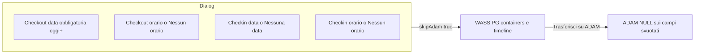

# Piano: check-in vuoto e orari check-in/out vuoti

## Comportamento concordato

- Salva dialog: resta `skipAdam: true` (PostgreSQL / container / timeline WASS). ADAM solo con **Trasferisci su ADAM**.
- **Check-out data**: obbligatoria. Non esiste “Nessuna data”. Si può solo cambiare. Le **nuove** date ammesse sono oggi o future (giorni passati disabilitati nel calendario). Una data passata già arrivata da ADAM resta visibile finché l’utente non ne sceglie una nuova.
- **Check-out orario**: si può mettere **Nessun orario** (`null`).
- **Check-in data**: **Nessuna data** (`null`); se si svuota la data si azzera anche l’orario.
- **Check-in orario**: **Nessun orario** (`null`); orario senza data resta vietato.
- Testi in dettaglio task:
  - ADAM non ha inviato il campo → `non migrato` / `orario non migrato`
  - utente WASS ha svuotato → `Nessuna data` / `Nessun orario`

## 1. Etichette: missing vs cleared

Oggi in [`task-card.tsx`](client/src/components/drag-drop/task-card.tsx) qualsiasi `null` è “non migrato”.

Sulla task (container/timeline) persistere flag WASS-only, scritti da `/api/update-task-details`:

- `checkout_time_cleared`
- `checkin_date_cleared`
- `checkin_time_cleared`

Regole:

- Extract ADAM con campo `NULL` → valore `null`, flag **non** settati → “non migrato”.
- Utente salva `null` su orario/data check-in → valore `null` + flag `true` → “Nessun orario” / “Nessuna data”.
- Utente rimette un valore → flag `false`.
- Helper unico tipo `formatCheckFieldLabel(...)` per i due input in dettaglio (stesso schema in [`unconfirmed-tasks.tsx`](client/src/pages/unconfirmed-tasks.tsx) se mostra gli stessi testi).

## 2. Dialog check-out / check-in

File principale: [`client/src/components/drag-drop/task-card.tsx`](client/src/components/drag-drop/task-card.tsx).

**Check-out**

- Calendario: `disabled={{ before: startOfToday }}` (DayPicker in [`calendar.tsx`](client/src/components/ui/calendar.tsx) lo supporta già). Nessun bottone “Nessuna data”.
- Select ora/min: togliere il fallback `|| "00:00"`. Aggiungere voce `none` = **Nessun orario** che mette `editingCheckoutTimeInDialog` a `""`.
- `handleSaveCheckout`: rifiutare `date == null`; rifiutare data **nuova** `< oggi`; accettare `time == null`.

**Check-in**

- Bottone **Nessuna data** (svuota data e orario).
- Stessa voce **Nessun orario** sui select.
- Se data vuota e orario valorizzato: errore già esistente.

Validazione check-in vs check-out: confrontare solo se entrambi hanno data **e** orario (già così).

## 3. API `POST /api/update-task-details`

In [`server/routes.ts`](server/routes.ts) (`updateTask` ~7854):

- Scrivere i tre flag `*_cleared` insieme ai campi.
- Rifiutare `checkoutDate == null` (400).
- Rifiutare se `checkoutDate` è una data **modificata** verso un giorno `< oggi` (la data invariata nel passato da ADAM è ok).
- `checkoutTime` / `checkinDate` / `checkinTime` a `null` restano ammessi.
- Spostamento container per giornata resta su `checkout_date` (mai null con queste regole).
- Riclassifica EO/HP/LP invariata: `null` fa semplicemente non scattare le regole che usano quell’orario/data.

`skipAdam` resta `true` dal client.

## 4. Trasferimento ADAM

[`POST /api/transfer-to-adam`](server/routes.ts) scrive già `checkout` / `checkout_time` / `checkin` / `checkin_time` da timeline, e `formatDateForMySQL` / `formatTimeForMySQL` già tornano `null`.

Verificare che un orario/data check-in svuotati in WASS arrivino come `NULL` SQL, non vengano omessi o mandati come `00:00`. Nessun cambio di `skipAdam` sul dialog.

## 5. Refresh da ADAM

Se si rigenerano i container da ADAM, i flag WASS sparirebbero e “Nessun orario” tornerebbe “non migrato”.

Nel merge/refresh container (housekeeping e, se stesso flusso, logistics): per `task_id` già presente, se ADAM manda `NULL` e WASS ha `*_cleared === true`, **conservare** valore `null` + flag. Se ADAM manda un valore, usare ADAM e azzerare il flag.

Checkout data non è mai cleared, quindi `WHERE h.checkout = data` non cambia per questo lavoro.

## File toccati

- [`client/src/components/drag-drop/task-card.tsx`](client/src/components/drag-drop/task-card.tsx) — UI dialog, validazione, label
- [`server/routes.ts`](server/routes.ts) — persistenza flag, reject checkout null/passato in modifica
- Refresh containers (il servizio già usato da `/api/containers/refresh` e analogo logistics) — merge flag
- [`client/src/pages/unconfirmed-tasks.tsx`](client/src/pages/unconfirmed-tasks.tsx) — stessi testi se mostra check-in/out

## Fuori scope

- Svuotare la **data** di check-out
- Scrittura ADAM al Salva del dialog
- Togliere dalla timeline di oggi un task il cui check-out è stato spostato a un altro giorno
