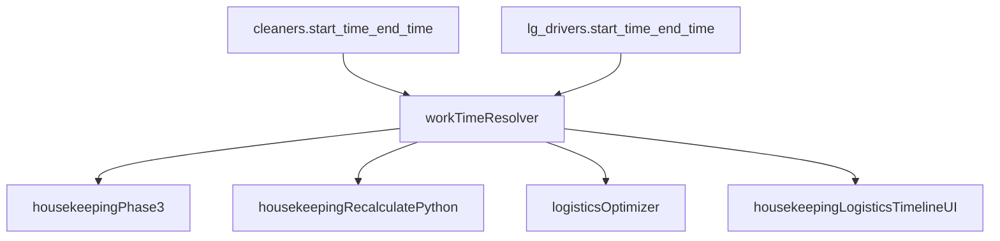

# Piano introduzione end time cleaner/driver

## Obiettivo
Allineare housekeeping e logistica a un modello simmetrico con `start_time`/`end_time` per risorsa, rimuovendo i limiti hardcoded di fine giornata e usando default `20:00` (con fallback coerenti).

## Mappa attuale (da sostituire)
- Housekeeping usa fine fissa in più punti:
  - [`C:/Users/asus/Desktop/wass/server/services/optimizer/phase3.ts`](C:/Users/asus/Desktop/wass/server/services/optimizer/phase3.ts) (`1140` / `19:00`)
  - [`C:/Users/asus/Desktop/wass/client/public/scripts/recalculate_times.py`](C:/Users/asus/Desktop/wass/client/public/scripts/recalculate_times.py) (`WORK_END_TIME = "19:00"`)
  - [`C:/Users/asus/Desktop/wass/client/public/scripts/assign_eo.py`](C:/Users/asus/Desktop/wass/client/public/scripts/assign_eo.py), [`C:/Users/asus/Desktop/wass/client/public/scripts/assign_lp.py`](C:/Users/asus/Desktop/wass/client/public/scripts/assign_lp.py), [`C:/Users/asus/Desktop/wass/client/public/scripts/assign_hp.py`](C:/Users/asus/Desktop/wass/client/public/scripts/assign_hp.py)
  - [`C:/Users/asus/Desktop/wass/client/src/components/timeline/timeline-view.tsx`](C:/Users/asus/Desktop/wass/client/src/components/timeline/timeline-view.tsx) (`endHour=19`, `19*60`)
- Logistica ha disallineamento hardcoded:
  - UI a `19:00` in [`C:/Users/asus/Desktop/wass/client/src/components/timeline/logistics-timeline-view.tsx`](C:/Users/asus/Desktop/wass/client/src/components/timeline/logistics-timeline-view.tsx)
  - Optimizer a `23:59` in [`C:/Users/asus/Desktop/wass/server/services/logistics-optimizer-final/normalizers.ts`](C:/Users/asus/Desktop/wass/server/services/logistics-optimizer-final/normalizers.ts), [`C:/Users/asus/Desktop/wass/server/services/logistics-optimizer-final/windows.ts`](C:/Users/asus/Desktop/wass/server/services/logistics-optimizer-final/windows.ts), [`C:/Users/asus/Desktop/wass/server/services/logistics-optimizer-final/build-routing-input.ts`](C:/Users/asus/Desktop/wass/server/services/logistics-optimizer-final/build-routing-input.ts)

## Flusso target

## Implementazione proposta

### 1) Database e migrazioni
- Regola applicata: aggiungiamo `end_time` solo dove esiste già il corrispettivo `start`.
- Mappatura esplicita:
  - `cleaners.start_time` -> `cleaners.end_time`
  - `cleaners_history.start_time` -> `cleaners_history.end_time`
  - `lg_drivers.start_time` -> `lg_drivers.end_time`
  - `daily_assignments_current.cleaner_start_time` -> `daily_assignments_current.cleaner_end_time`
  - `daily_assignments_history.cleaner_start_time` -> `daily_assignments_history.cleaner_end_time`
  - `lg_timeline.driver_start_time` -> `lg_timeline.driver_end_time`
  - `lg_timeline_history.driver_start_time` -> `lg_timeline_history.driver_end_time`
- Aggiungere campi roster:
  - `cleaners.end_time VARCHAR(10) NOT NULL DEFAULT '20:00'`
  - `cleaners_history.end_time VARCHAR(10)`
  - `lg_drivers.end_time VARCHAR(10) NOT NULL DEFAULT '20:00'`
- Aggiungere campi denormalizzati timeline:
  - `daily_assignments_current.cleaner_end_time VARCHAR(10) DEFAULT '20:00'`
  - `daily_assignments_history.cleaner_end_time VARCHAR(10) DEFAULT '20:00'`
  - `lg_timeline.driver_end_time VARCHAR(10) DEFAULT '20:00'`
  - `lg_timeline_history.driver_end_time VARCHAR(10) DEFAULT '20:00'`
- Backfill `NULL -> '20:00'` dove necessario.
- File principali:
  - [`C:/Users/asus/Desktop/wass/scripts/create-pg-cleaners-tables.ts`](C:/Users/asus/Desktop/wass/scripts/create-pg-cleaners-tables.ts)
  - [`C:/Users/asus/Desktop/wass/scripts/create-pg-lg-drivers.ts`](C:/Users/asus/Desktop/wass/scripts/create-pg-lg-drivers.ts)
  - [`C:/Users/asus/Desktop/wass/scripts/create-pg-logistics-assignments-timeline.ts`](C:/Users/asus/Desktop/wass/scripts/create-pg-logistics-assignments-timeline.ts)
  - nuova migration dedicata (es. `scripts/add-end-time-fields.ts`)

### 1.1) Regole anti-confusione (shift vs task)
- Convenzione semantica obbligatoria:
  - `cleaner_start_time` / `cleaner_end_time` = orari turno cleaner.
  - `driver_start_time` / `driver_end_time` = orari turno driver.
  - `start_time` / `end_time` (senza prefisso) = orari del task assegnato.
- Tabelle dove coesistono entrambi (serve massima attenzione nelle query):
  - `daily_assignments_current`: `cleaner_start_time` (+ nuovo `cleaner_end_time`) e `start_time`/`end_time` task.
  - `daily_assignments_history`: `cleaner_start_time` (+ nuovo `cleaner_end_time`) e `start_time`/`end_time` task.
  - `lg_timeline`: `driver_start_time` (+ nuovo `driver_end_time`) e `start_time`/`end_time` task.
  - `lg_timeline_history`: `driver_start_time` (+ nuovo `driver_end_time`) e `start_time`/`end_time` task.
- Regola mapping in codice:
  - `row.cleaner_start_time`/`row.cleaner_end_time` <-> `cleaner.start_time`/`cleaner.end_time`.
  - `row.driver_start_time`/`row.driver_end_time` <-> `driver.start_time`/`driver.end_time`.
  - `row.start_time`/`row.end_time` <-> `task.start_time`/`task.end_time`.
- Per ridurre errori nelle query SQL, mantenere ordine colonne: prima campi risorsa (`cleaner_*`/`driver_*`), poi campi task (`start_time`, `end_time`).

### 2) Service layer e normalizzazione
- Estendere modelli/row mapping in [`C:/Users/asus/Desktop/wass/server/services/pg-daily-assignments-service.ts`](C:/Users/asus/Desktop/wass/server/services/pg-daily-assignments-service.ts):
  - `cleaner_end_time` e `driver_end_time` in lettura/scrittura timeline.
  - `end_time` in save/load cleaners e drivers.
  - Consentire update field `end_time` (`updateCleanerField`, `updateLgDriverField`).
- Estendere normalizzazione in [`C:/Users/asus/Desktop/wass/server/services/workspace-files.ts`](C:/Users/asus/Desktop/wass/server/services/workspace-files.ts):
  - cleaner/driver `end_time ?? '20:00'`.

### 3) API e payload
- Housekeeping (`routes.ts`):
  - Nuovo endpoint speculare a start: `POST /api/update-cleaner-end-time`.
  - Propagare `end_time` in `save-selected-cleaners`, `POST /api/cleaners`, payload di recalc python.
- Logistica (`routes.ts` + mutation routes):
  - Nuovo endpoint `POST /api/update-logistics-driver-end-time` (o validazione forte su endpoint generic field).
  - Propagare `end_time` in `POST /api/logistics-drivers`, add-driver-to-timeline e mutation flows.
- Aggiungere validazioni: formato `HH:mm`, opzionale `end_time > start_time`.
- File principali:
  - [`C:/Users/asus/Desktop/wass/server/routes.ts`](C:/Users/asus/Desktop/wass/server/routes.ts)
  - [`C:/Users/asus/Desktop/wass/server/logistics-timeline-mutation-routes.ts`](C:/Users/asus/Desktop/wass/server/logistics-timeline-mutation-routes.ts)

### 4) Housekeeping optimizer e script
- Sostituire limite Phase3 (`1140`) con `cleaner.end_time` (fallback `1200`) in [`C:/Users/asus/Desktop/wass/server/services/optimizer/phase3.ts`](C:/Users/asus/Desktop/wass/server/services/optimizer/phase3.ts).
- Estendere loader/call chain (`runPhase3.ts`, `runPhase4.ts`, `runAllPhases.ts`) per passare start+end del cleaner.
- In [`C:/Users/asus/Desktop/wass/client/public/scripts/recalculate_times.py`](C:/Users/asus/Desktop/wass/client/public/scripts/recalculate_times.py), usare `cleaner.end_time` con fallback `20:00` al posto di `WORK_END_TIME` hardcoded.
- Allineare legacy assignment scripts EO/HP/LP al nuovo end per-cleaner.

### 5) Logistica optimizer
- Estendere driver model con `endTime` in:
  - [`C:/Users/asus/Desktop/wass/server/services/logistics-optimizer-final/loaders.ts`](C:/Users/asus/Desktop/wass/server/services/logistics-optimizer-final/loaders.ts)
  - [`C:/Users/asus/Desktop/wass/server/services/logistics-optimizer-final/build-routing-input.ts`](C:/Users/asus/Desktop/wass/server/services/logistics-optimizer-final/build-routing-input.ts)
  - [`C:/Users/asus/Desktop/wass/server/services/logistics-optimizer-final/normalizers.ts`](C:/Users/asus/Desktop/wass/server/services/logistics-optimizer-final/normalizers.ts)
- Rimuovere fallback universale `23:59` per disponibilità driver e usare default `20:00`.
- Aggiornare scheduler logistica legacy (`phase2.ts`, `logistics-driver-schedule.ts`, `logistics-timeline-utils.ts`) per rispettare `driver_end_time`.

### 6) UI housekeeping e logistica
- Housekeeping timeline: sostituire end timeline fisso con end dinamico (es. max `cleaner.end_time` tra cleaners visibili) in [`C:/Users/asus/Desktop/wass/client/src/components/timeline/timeline-view.tsx`](C:/Users/asus/Desktop/wass/client/src/components/timeline/timeline-view.tsx).
- Logistica timeline: stessa logica in [`C:/Users/asus/Desktop/wass/client/src/components/timeline/logistics-timeline-view.tsx`](C:/Users/asus/Desktop/wass/client/src/components/timeline/logistics-timeline-view.tsx).
- Convocazioni/dialog: aggiungere editor `End Time` simmetrico a `Start Time` in [`C:/Users/asus/Desktop/wass/client/src/pages/convocazioni.tsx`](C:/Users/asus/Desktop/wass/client/src/pages/convocazioni.tsx) e componenti correlate.

### 7) Consistenza defaults e cleanup
- Uniformare i fallback start ancora a `09:00` verso `10:00` nei punti optimizer housekeeping (`runPhase3.ts`, `runPhase4.ts`, `phase3.ts`).
- Centralizzare costanti default in utility condivisa (es. `DEFAULT_CLEANER_START=10:00`, `DEFAULT_CLEANER_END=20:00`, analoghi driver) per evitare nuovi hardcode.

### 8) Verifica e test
- Aggiornare test/unit dove presenti (routing/logistics e scheduling).
- Verifiche funzionali minime:
  - cleaner con `end_time=20:00` non riceve task che finisce oltre 20:00;
  - driver con `end_time=20:00` non supera il limite in recalc/optimizer;
  - timeline UI estesa correttamente senza `19:00` fisso;
  - creazione/aggiornamento risorsa senza `end_time` esplicito imposta `20:00`.
