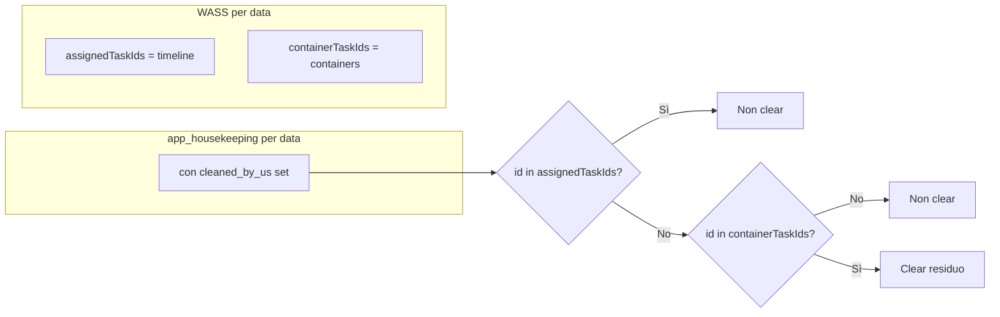

# Piano: limitare il cleanup ADAM al secondo trasferimento alle sole task WASS

## Problema attuale

Nella fase di cleanup (secondo invio in poi) in [server/routes.ts](server/routes.ts) (POST `/api/transfer-to-adam`), vengono ripulite **tutte** le righe di `app_housekeeping` per quella data che hanno `cleaned_by_us IS NOT NULL` e il cui `id` non è in `assignedTaskIds`. Così finiscono per essere azzerate anche task che WASS non gestisce (es. interventi con `operation_id` che WASS non schedula, come la logistica id=5), con il rischio di toccare dati che non dovrebbero essere modificati.

## Obiettivo

- Al secondo (e successivi) trasferimenti, ripulire solo le task che hanno **assegnazioni residue** e che **WASS gestisce**: cioè task che sono nei **containers** per quella data (e non in timeline).
- Non toccare le task con intervento che WASS non schedula (né in timeline né in containers).

## Strategia

Usare come perimetro “gestito da WASS” l’insieme delle task presenti nei **containers** (PostgreSQL, `daily_containers` / `workspaceFiles.loadContainers`). Le task in containers sono per definizione quelle che WASS considera per la schedulazione; se una task non è in timeline né in containers, non va mai ripulita.

- **Candidati al clear:** task in `app_housekeeping` per quella data con `cleaned_by_us IS NOT NULL`, `id` non in `assignedTaskIds`, e `**id` presente nei containers** per quella data.
- **Non toccare:** task il cui `id` non compare nei containers (inclusi gli interventi che WASS non schedula).

## File da modificare

- [server/routes.ts](server/routes.ts): endpoint `POST /api/transfer-to-adam` (zona cleanup ~5210–5296).

## Implementazione

### 1. Costruire l’insieme dei task nei containers

- **Dove:** subito dopo la costruzione di `assignedTaskIds` (dopo il ciclo su `timelineData.cleaners_assignments`), e prima del `try` che apre la connessione MySQL.
- **Cosa fare:**
  - Chiamare `workspaceFiles.loadContainers(workDate)`.
  - Costruire un `Set<number>` (es. `containerTaskIds`) con tutti i `task_id` presenti in:
    - `containersData.containers.early_out.tasks`
    - `containersData.containers.high_priority.tasks`
    - `containersData.containers.low_priority.tasks`
  - Se `loadContainers` restituisce `null` o una struttura senza tasks, usare un set vuoto (in quel caso non si ripulisce nessuna task).

### 2. Filtrare gli id da ripulire con i soli task in containers

- **Dove:** nel blocco “Cleanup ADAM: clear tasks not in timeline (solo dal secondo invio)”, quando si costruisce `idsToClear`.
- **Modifica:** dopo aver ottenuto gli `id` dalla query su `app_housekeeping` (stessa query di oggi: `checkout = ?`, `deleted_at IS NULL`, `deleted_at_client IS NULL`, `cleaned_by_us IS NOT NULL`), includere un id in `idsToClear` **solo se**:
  - `id` non è in `assignedTaskIds`, **e**
  - `id` è in `containerTaskIds`.
- In questo modo si ripuliscono solo le task che sono nei containers e che hanno ancora un’assegnazione su ADAM (residuo di trasferimenti precedenti). Le task che non compaiono nei containers (incluse quelle con operation_id non schedulato da WASS) non vengono mai toccate.

### 3. Nessuna modifica alla query ADAM

- La query su `app_housekeeping` resta come oggi (senza filtri su `operation_id`). Il filtro “solo task WASS” avviene in memoria con `containerTaskIds`, evitando di dover esporre o usare la lista delle operation attive da ADAM in questa fase.

## Riepilogo modifiche

| Punto                    | Azione                                                                                                                                                       |
| ------------------------ | ------------------------------------------------------------------------------------------------------------------------------------------------------------ |
| Dopo `assignedTaskIds`   | Caricare containers con `workspaceFiles.loadContainers(workDate)` e costruire `containerTaskIds` (Set di task_id da early_out, high_priority, low_priority). |
| Costruzione `idsToClear` | Aggiungere condizione: `containerTaskIds.has(id)` oltre a `!assignedTaskIds.has(id)`.                                                                        |

Comportamento atteso: al secondo trasferimento si azzerano solo le task con assegnazione residua che sono **nei containers**; le task con intervento che WASS non schedula (non presenti in timeline né in containers) non vengono mai modificate.