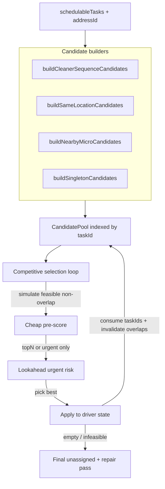

# Competitive Grouping (Step 4.6) — Implementation Plan

## Obiettivo

Implementare in [server/services/logistics-optimizer/phase2.ts](server/services/logistics-optimizer/phase2.ts) un **candidate pool competitivo** dove cleaner-sequence, same-location, nearby e singleton competono per score comparabile, con driver order cleaner come preferenza (non hard law).

Rollout con safety flag tecnica temporanea:

- `LOGISTICS_COMPETITIVE_GROUPING=1` abilita il nuovo selettore competitivo.
- assenza/`0` usa il percorso legacy attuale.
- obiettivo: confronto rapido OFF vs ON per 2-3 run reali prima della rimozione flag.

## Architettura nuova



## File da modificare

- [server/services/logistics-optimizer/phase2.ts](server/services/logistics-optimizer/phase2.ts) — modifiche principali (nuovo selettore + guardia flag + scoring V2).
- [server/services/logistics-optimizer/phase2-debug.ts](server/services/logistics-optimizer/phase2-debug.ts) — nuovi tipi/contatori per i KPI.

## Dettaglio implementativo

### 1. Nuovi tipi (phase2.ts)

```ts
type CandidateType = "CLEANER_SEQUENCE" | "SAME_LOCATION" | "NEARBY_MICRO" | "SINGLETON";

interface Candidate {
  id: string;
  type: CandidateType;
  group: SpatialGroup;
  taskIds: number[];
  assignedTaskCount: number;
  preScore: number;
  priorityRank: number;
  compactnessScore: number;
  cleanerSequenceScore: number;
}
```

`SpatialGroup.origin` riusato per il debug; aggiungere mappatura `CandidateType → origin` (es. `NEARBY_MICRO → "GEOGRAPHIC_FALLBACK"` per compatibilità con `GroupCreatedJson`).

### 2. Builders dei candidati

Tutti puri: prendono `tasks: LogisticsTaskForPhase2[]` + `workDate` e ritornano `Candidate[]`. Riusano logica esistente:

- `buildCleanerSequenceCandidates` → wrappa la cleaner-cluster logic di `buildCleanerAwareGroups` ([phase2.ts L1071](server/services/logistics-optimizer/phase2.ts)) per produrre cluster + sub-cluster (size 2..k).
- `buildSameLocationCandidates` → estende `buildStrongLocationClusters` ([phase2.ts L905](server/services/logistics-optimizer/phase2.ts)) a tutti i task con `addressId != null` (non solo fallbackTasks), incluse sub-coppie quando `members.length > 2`.
- `buildNearbyMicroCandidates` → genera coppie/triplette con travel mutuo ≤ `NEARBY_TASKS_TRAVEL_MAX_MIN` (5 min). Cap `top-K=3` per task per evitare esplosione combinatoria.
- `buildSingletonCandidates` → ultimo resort: un candidato per task.

Cap globale: max `MAX_CANDIDATES_PER_TASK = 6` (sommando i tipi). Retention order per task:

1. same-location
2. cleaner-sequence
3. nearby-micro
4. singleton
5. eventuali extra per `preScore` decrescente

### 3. Selezione competitiva (sostituisce il main loop)

Sostituire il blocco a [phase2.ts L2727-L2895](server/services/logistics-optimizer/phase2.ts) con selettore competitivo condizionato da flag:

```ts
if (!isCompetitiveGroupingEnabled()) {
  // percorso legacy FIFO invariato (baseline confronto)
  runLegacyGroupingLoop(...);
} else {
  const consumed = new Set<number>();
  let pool = buildAllCandidates(schedulableTasks, phase1, workDate);

  while (true) {
    const eligible = pool.filter(c => c.taskIds.every(id => !consumed.has(id)));
    if (eligible.length === 0) break;

    // 1) cheap pre-score su tutti i candidati
    const ranked = rankCandidatesWithCheapScore(eligible, ...);
    const topForLookahead = selectTopNOrUrgent(ranked, { topN: 15 });

    // 2) simulazione completa + lookahead solo su top-N/urgenti
    const bestPick = pickBestCompetitiveCandidate(topForLookahead, ...);

    if (!bestPick) {
      // Nessun full-feasible: partial su top-N, non solo top-1
      const partial = pickBestPartialAcrossCandidates(topForLookahead, ...);
      if (!partial) break;
      applyAndRecordPartial(partial);
      partial.assignedTaskIds.forEach(id => consumed.add(id));
      continue;
    }

    applySimulationToDriverState(bestPick.driverState, bestPick.simulation);
    bestPick.candidate.taskIds.forEach(id => consumed.add(id));
    recordCompetitiveDecision(bestPick, ranked);

    pool = invalidateAndRegenerate(pool, consumed, schedulableTasks, workDate);
  }
}

// Task non selezionati → singleton recovery + repair pass (riuso logica esistente)
```

### 4. Scoring: ricalibrazione penalità

In `simulateOrderedTasksForDriver` ([phase2.ts L1407-L1689](server/services/logistics-optimizer/phase2.ts)):

- Rendere lo score comparabile per cardinalità candidati con `assignedTaskReward = candidate.taskIds.length * ASSIGNED_TASK_WEIGHT`.
- Mantenere e irrobustire la regola: `sameLocationSplitPenalty > cleanerSequenceBreakPenalty`.
- Introdurre penalità same-location separate:
  - `SAME_LOCATION_SPLIT_PENALTY_PER_GAP = 14`
  - `SAME_LOCATION_CROSS_DRIVER_SPLIT_PENALTY = 40`
  - `SAME_LOCATION_RETURN_AFTER_60_MIN_PENALTY = 25`
- Aggiungere `cleanerSequenceBreakPenalty` su full-route (peso inferiore alle penalità same-location).
- Aggiungere `missedUrgentTaskRisk` ma solo in valutazione lookahead top-N/urgenti.

Nuova formula score (in `simulateOrderedTasksForDriver`):

```
score = assignedTaskReward
      - travelMinutesDelta
      - waitPenalty
      - slackPenalty
      - sameLocationSplitPenalty
      - sameLocationCrossDriverSplitPenalty
      - sameLocationReturnAfter60Penalty
      - cleanerSequenceBreakPenalty
      - missedUrgentTaskRisk
      - fallbackCompactnessPenalty
      - priorityPenaltyDelta * 2
      - fairnessPenalty
      - bandPenalty
      + cleanerContinuityBonus
      + cleanerClusterBonus
      + strongLocationClusterBonus
      + bagDeliveryUrgencyBonus
      + sameLocationBonus
      + nearbyContinuityBonus
```

Tie-break finale esplicito per parità ravvicinate:

1. meno split same-location (soprattutto cross-driver)
2. maggiore slack residuo
3. minore travel delta
4. maggiore cleaner continuity
5. `candidate.id` lessicografico per determinismo

### 5. Lookahead limitato (fase 1 performance-safe)

`missedUrgentTaskRisk` si calcola solo per candidati selezionati da `selectTopNOrUrgent`:

- top `N=15` da pre-score;
- candidati con task `deadline <= 11:00`;
- candidati con almeno un task `requiresDriverBeforeCleaner`;
- candidati che includono task con `feasibleInsertionCount <= 1`.

Approccio a due fasi:

1. pre-score cheap su tutti i candidati (senza lookahead)
2. lookahead completo solo su top-N/urgenti

### 6. Debug & KPI (phase2-debug.ts)

Estendere [LogisticsPhase2GroupingStatsJson](server/services/logistics-optimizer/phase2-debug.ts) con:

- `competitiveCandidatesGenerated: number`
- `competitiveCandidatesSelectedByType: Record<CandidateType, number>`
- `cleanerClusterBeatenBySameLocationCount: number`
- `sameLocationBeatenByCleanerClusterCount: number`
- `sameLocationSplitAcceptedCount: number` + array `sameLocationSplitAcceptedReasons: string[]`
- `candidateOverlapInvalidationCount: number`
- `avgReturnToSameAddressAfterSplitMin: number`
- `selectedCandidateScoreGapP50: number` + `P90: number` (gap = winner.score − runnerUp.score)
- `sameLocationReturnEvents: Array<{ addressId; logisticCode; taskIds; driverIds; sequencePositions; minutesBetweenVisits; reason }>`

Aggiungere nuovo `GroupingStrategy` value `"NEARBY_MICRO_CLUSTER"` accanto agli esistenti.

Estendere `GroupDecisionJson` con campo opzionale:

```ts
competitiveContext?: {
  candidateType: CandidateType;
  competitorsConsidered: Array<{ id: string; type: CandidateType; score: number | null; feasible: boolean }>;
  scoreGapToRunnerUp: number | null;
};
```

Nessuna breaking change su `01-groups-created.json` / `02-group-decisions.json`: solo campi aggiuntivi.

### 7. Validazione

- Compile-check con `tsc` + linter sul file modificato.
- Run A/B su stesso workDate:
  - baseline: `LOGISTICS_COMPETITIVE_GROUPING=0 LOGISTICS_OPTIMIZER_DEBUG=1`
  - nuovo: `LOGISTICS_COMPETITIVE_GROUPING=1 LOGISTICS_OPTIMIZER_DEBUG=1`
- Verifica in `02-group-decisions.json` del caso VIA MARGHERA 43 / 1744: il same-location `[1744a, 1744b]` deve vincere quando fattibile; se perde, la reason deve essere esplicita in `competitiveContext` e/o `sameLocationSplitAcceptedReasons`.
- Confronto KPI A/B: `tasksAssigned`, `groupsSplit`, `repairInsertedTasks`, `sameLocationSplitAcceptedCount`, `sameLocationReturnEvents`, `selectedCandidateScoreGapP90`, `scheduleBuildCount`.

## Punti di attenzione

- **Feature flag lifecycle**: mantenere `LOGISTICS_COMPETITIVE_GROUPING` per 2-3 run buone consecutive; poi rimuovere path legacy e flag in cleanup dedicato.
- **Performance**: il selettore è O(|candidates| × |drivers|) per iterazione, con `|candidates| ≤ N × MAX_CANDIDATES_PER_TASK` e ricostruzione incrementale. Lookahead limitato top-N/urgenti per contenere costo.
- **Determinismo**: i builders devono ordinare i task per `taskId` come tie-breaker (già fatto in `buildStrongLocationClusters`); il selettore usa `(score desc, candidate.id asc)` per essere riproducibile.
- **Repair pass finale**: invariato (`repairUnassignedTasksWithInsertion` resta come oggi).
- **`buildCleanerAwareGroups` non viene rimosso**: continua a essere il motore che produce i cleaner-cluster candidates (estratto e riusato dal builder). La parte di `compareGroups` / `pendingGroups`-FIFO viene rimossa dal main loop.