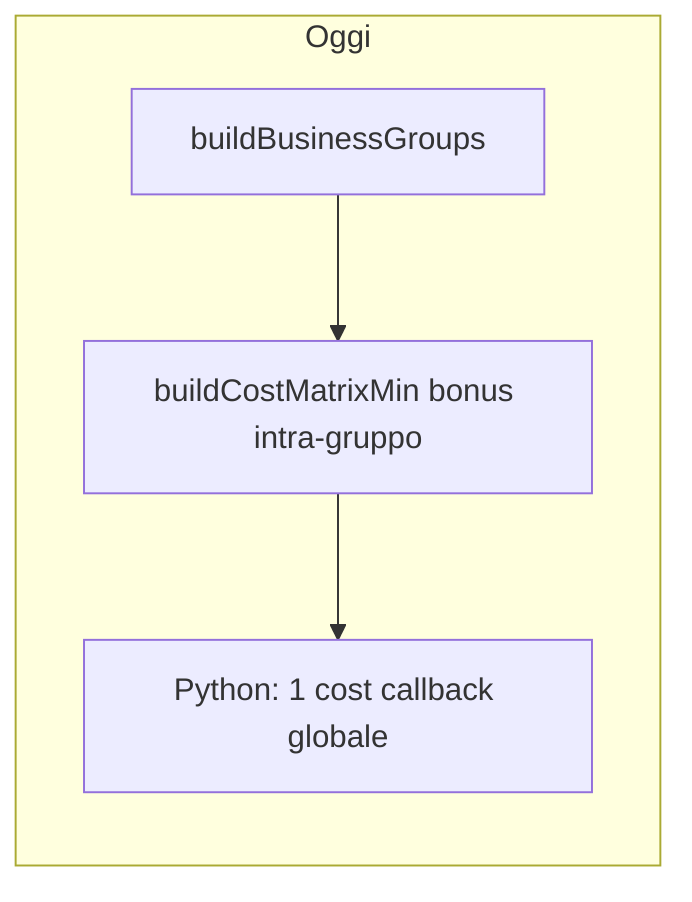
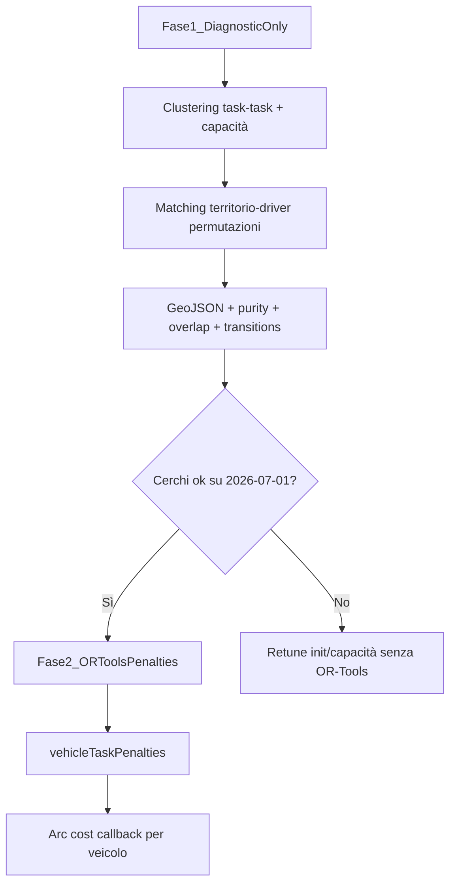
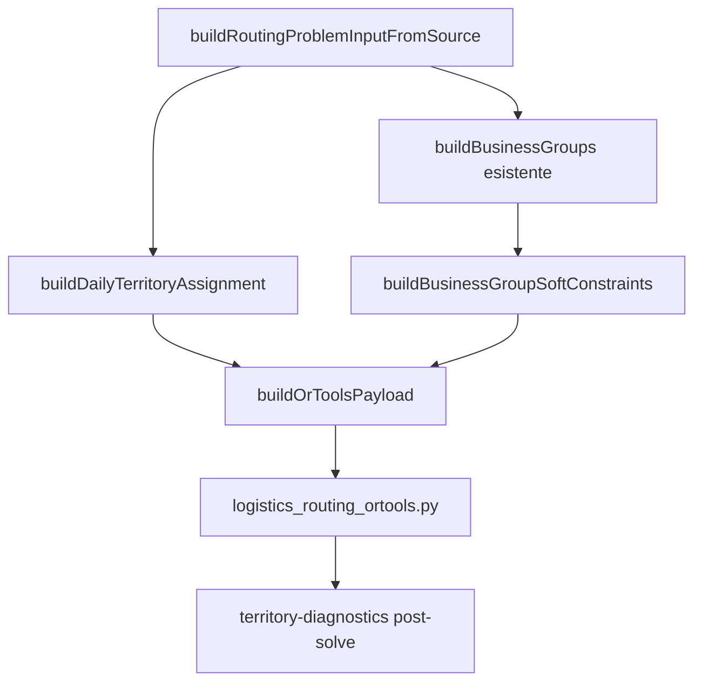

# Daily Territory Assignment v2 — piano di implementazione

## Contesto

Lavoro su **branch dedicato** — nessun rollout production-safe graduale.

**Modello flag (lineare, non contraddittorio):**

```txt
Il codice supporta entrambe le modalità.

Default finale del branch:
  debugTerritoriesEnabled = true
  routingPenaltiesEnabled = true   ← penalità attive una volta completato Step B

Durante Step A e test di wiring:
  routingPenaltiesEnabled = false  ← via LOGISTICS_TERRITORY_PENALTIES=0 o override test
```

- Step A e Step B nella **stessa PR**, commit/step logici separati
- `routingPenaltiesEnabled=false` è uno **stato temporaneo** di Step A/test, non il default finale
- **Solver identity regression** obbligatoria in Step A: protegge dal bug più pericoloso (`DAILY_TERRITORY` che finisce in cost matrix o soft constraints per sbaglio)

## Obiettivo

Produrre route con **bacini geografici macro** (~12–16 task per driver su 42 task / 3 driver), simili ai cerchi ovest / nord-est / sud-est. Ogni driver resta preferenzialmente nel proprio territorio; OR-Tools può violare la regola solo per feasibility (time windows, `REQUIRED_DRIVER`, same-building).

## Stato attuale (gap corretto)



- [`nearby-cluster-groups.ts`](server/services/logistics-optimizer-final/groups/nearby-cluster-groups.ts): cluster **locali** seed-based — possono essere troppo piccoli o troppo grandi (es. blob da 31 task), **non bilanciati** sul numero di driver, **senza preferenza driver-task**
- [`ortools-adapter.ts`](server/services/logistics-optimizer-final/solver/ortools/ortools-adapter.ts): soft groups → bonus su `costMatrixMin` (arco `from→to`), non preferenza per veicolo
- [`logistics_routing_ortools.py`](server/services/logistics-optimizer-final/solver/ortools/logistics_routing_ortools.py): `SetArcCostEvaluatorOfAllVehicles` — un solo callback

Il solver vede task vicini, ma non vede "questa è la zona del driver X".

## Rollout in due fasi



**Step A — diagnostic-only** (`LOGISTICS_TERRITORY_PENALTIES=0`):
- genera territori, metadata, business groups `DAILY_TERRITORY`, GeoJSON e diagnostiche
- **zero effetto sul solver** — nessuna `vehicleTaskPenalties`, nessuna modifica a `costMatrixMin` per territori
- verifica visiva `territories.geojson` + solver identity regression

**Step B — default finale branch** (`routingPenaltiesEnabled=true`):
- `vehicleTaskPenalties` + callback arc cost per veicolo
- time dimension invariata
- dry-run 2026-07-01 + tuning 90/55/20

### Invariante critica (Step A / test)

Con `routingPenaltiesEnabled=false` (env `LOGISTICS_TERRITORY_PENALTIES=0` o override test), la soluzione OR-Tools deve essere **identica** alla baseline. Se cambia anche solo una stop sequence, c’è un bug di wiring.

Checklist wiring sicuro:
- `DAILY_TERRITORY` groups **non** entrano in `buildBusinessGroupSoftConstraints`
- `DAILY_TERRITORY` groups **non** entrano in `buildCostMatrixMin`
- `buildOrToolsPayload` **non** emette `vehicleTaskPenalties`
- Python usa il callback arc cost **globale** esistente (non per-veicolo)

Test obbligatorio (Step A): `debugTerritoriesEnabled=true` + `routingPenaltiesEnabled=false` → stesse `routes` / `assignedTaskIds` vs baseline senza territori.

---

## Architettura target



**Gerarchia vincoli** (invariata + nuovo layer):

| Layer | Peso | Ruolo |
|---|---|---|
| `REQUIRED_DRIVER` | hard | override totale |
| `SAME_COORDINATES_BUILDING` | 100 | stesso edificio |
| `NEARBY_CLUSTER` | 45 | compattezza intra-territorio |
| **Daily territory mismatch** | 90 / 55 / 20 | bacino macro per driver |

I `NEARBY_CLUSTER` **restano** come layer locale sotto i macro-territori.

---

## 1. Configurazione

Nuovo file [`groups/territory-config.ts`](server/services/logistics-optimizer-final/groups/territory-config.ts).

### Costanti algoritmo (non runtime)

```ts
export const TERRITORY_ALGO_CONFIG = {
  territoryCountMode: "drivers" as const,
  minTasksPerTerritory: 4,
  balanceToleranceTasks: 2,
  maxIterations: 30,
  penaltyRadiusPercentile: 0.90,
  coreMismatchPenaltyMin: 90,
  normalMismatchPenaltyMin: 55,
  borderMismatchPenaltyMin: 20,
  coreRadiusRatio: 0.65,
  borderRadiusRatio: 0.90,
  requiredDriverTerritoryBiasMin: 800,
};
```

### Flag runtime

Il codice supporta entrambe le modalità. Default **finale del branch** con penalità ON; Step A forza OFF via env.

```ts
export function resolveTerritoryFlags(): {
  debugTerritoriesEnabled: boolean;
  routingPenaltiesEnabled: boolean;
} {
  const debugEnv = parseEnvBool(process.env.LOGISTICS_TERRITORY_DEBUG);
  const penaltiesEnv = parseEnvBool(process.env.LOGISTICS_TERRITORY_PENALTIES);

  return {
    debugTerritoriesEnabled: debugEnv ?? true,
    routingPenaltiesEnabled: penaltiesEnv ?? true, // default finale branch (Step B)
  };
}
```

| Env | Default branch | Uso |
|---|---|---|
| `LOGISTICS_TERRITORY_DEBUG` | `true` | `0` → disabilita tutto il modulo territori |
| `LOGISTICS_TERRITORY_PENALTIES` | `true` (finale) | **`0` durante Step A e test wiring** → solver invariato |

**Step A — dry-run e test:**

```bash
LOGISTICS_TERRITORY_PENALTIES=0 npm run ...   # territori + GeoJSON, route identica alla baseline
```

**Step B — default (env assente o `=1`):** penalità attive, per-vehicle arc cost callback.

**Semantica flag:**

| Flag | Effetto |
|---|---|
| `debugTerritoriesEnabled` | Clustering, metadata, `DAILY_TERRITORY` groups, GeoJSON, diagnostiche |
| `routingPenaltiesEnabled` | `vehicleTaskPenalties` in payload OR-Tools + callback arc cost per veicolo |

`routingPenaltiesEnabled` implica `debugTerritoriesEnabled` (se penalties ON ma debug OFF → trattare come errore config o forzare debug ON).

Helper `resolveTerritoryCapacity(taskCount, driverCount)` → `{ target, min, max }`.

---

## 2. Contratti dati

### [`groups/group-contract.ts`](server/services/logistics-optimizer-final/groups/group-contract.ts)

Aggiungere `DAILY_TERRITORY` a `BusinessGroupType` e:

```ts
export interface DailyTerritoryGroup extends BaseBusinessGroup {
  type: "DAILY_TERRITORY";
  territoryIndex: number;
  centroid: { lat: number; lng: number };
  radiusMeters: number;           // raggio visuale/debug (max distance dal centroide)
  penaltyRadiusMeters: number;    // raggio robusto p90 — usato per stickiness/penalità
  softBoundaryMeters: number;
  assignedDriverId: DriverId;
  source: "balanced_geo_cluster";
}
```

### [`input-contract.ts`](server/services/logistics-optimizer-final/input-contract.ts)

Aggiungere a `RoutingProblemMetadata`:

```ts
dailyTerritoryAssignment?: {
  debugTerritoriesEnabled: boolean;
  routingPenaltiesEnabled: boolean;
  territories: Array<{
    territoryId: string;
    territoryIndex: number;
    taskIds: TaskId[];
    centroid: { lat: number; lng: number };
    radiusMeters: number;
    penaltyRadiusMeters: number;
    assignedDriverId: DriverId;
    suggestedColor: string;
  }>;
  taskTerritoryIndex: Array<{ taskId: TaskId; territoryIndex: number }>;
  taskPreferredDriverId: Array<{ taskId: TaskId; driverId: DriverId }>;
};
```

Penalità in payload OR-Tools, non in `SoftConstraintSpec`.

---

## 3. Generazione territori

Nuovo file [`groups/daily-territory-groups.ts`](server/services/logistics-optimizer-final/groups/daily-territory-groups.ts).

### 3.1 Clustering geografico puro (senza REQUIRED_DRIVER)

**Input:** `tasks` eligibili (coordinate finite), `travelMatrixMin`, `k = drivers.length`

**Distanza task-task** (non depot-task):

```ts
distance(A, B) =
  effectiveTravelMin(travelMatrix, A.nodeIndex, B.nodeIndex)
  ?? haversineMeters(A, B)
```

**Init centroidi — regola deterministica:**

```ts
// seed[0] = task più centrale: min somma distanze verso tutti gli altri task
// tie-break: taskId minore
seed[i+1] = task che massimizza min distance verso seed già scelti
// tie-break: taskId minore
```

Evitare outlier come primo seed — la centralità produce bacini ovest / nord-est / sud-est più stabili.

**Loop** (max `maxIterations`):
- Assegna ogni task al centroide più vicino via **travel task→hub territorio** (fallback haversine)
- Rispetta capacità `{ min, max }` per territorio
- Ricalcola centroidi via [`geo-utils.ts`](server/services/logistics-optimizer-final/groups/geo-utils.ts)
- Calcola **due raggi** per territorio:
  - `radiusMeters` = max distance dal centroide (cerchio GeoJSON / debug visivo)
  - `penaltyRadiusMeters` = percentile p90 delle distanze task→centroide (robusto agli outlier)
- Bilanciamento finale: sposta task border (ratio > 0.90 vs `penaltyRadiusMeters`) da territori overfull a underfull

**`REQUIRED_DRIVER`:** partecipano al clustering come task normali (territorio geografico pulito). **Non** vengono spostati nel territorio del driver required.

### 3.2 Matching territorio → driver via permutazioni

Nuovo helper in [`groups/territory-driver-matching.ts`](server/services/logistics-optimizer-final/groups/territory-driver-matching.ts):

```ts
// k <= 7 → permutazioni esaustive (3! = 6, 5! = 120, 7! = 5040)
cost(territory, driver) =
  travelMatrixMin[depotOrStart][territoryCentroidHub]
  + requiredMismatchCount(territory, driver) * REQUIRED_DRIVER_TERRITORY_BIAS
  + optionalIncompatibilities(driver, territoryTasks)

// scegli permutazione con costo totale minimo
```

Gestisce driver con start/orari diversi e required driver senza deformare i cerchi.

### 3.3 Integrazione pipeline

In [`build-routing-input.ts`](server/services/logistics-optimizer-final/build-routing-input.ts):

```ts
const businessGroups = buildBusinessGroups(tasks, travelMatrixMin);
const requiredDriverByTaskId = /* da constraints timeline + same-building */;
const territoryBuild = buildDailyTerritoryAssignment({
  tasks, drivers, travelMatrixMin, requiredDriverByTaskId,
});
const allBusinessGroups = [...businessGroups, ...territoryBuild.groups];
// metadata.dailyTerritoryAssignment = territoryBuild.assignment
```

`buildBusinessGroupSoftConstraints` **non** emette constraint per `DAILY_TERRITORY`.

Se `debugTerritoriesEnabled === false`, skip intero blocco territori.

---

## 4. Penalità vehicle-task (Fase 2)

Nuovo file [`groups/territory-penalties.ts`](server/services/logistics-optimizer-final/groups/territory-penalties.ts).

Penalità **esplicite a tre livelli** (no moltiplicatori aggiuntivi):

```ts
function resolveTerritoryMismatchPenalty(ratio: number): number {
  if (ratio <= TERRITORY_ALGO_CONFIG.coreRadiusRatio) return coreMismatchPenaltyMin;   // 90
  if (ratio <= TERRITORY_ALGO_CONFIG.borderRadiusRatio) return normalMismatchPenaltyMin; // 55
  return borderMismatchPenaltyMin;                                                 // 20
}
// ratio = haversine(task, centroid) / penaltyRadiusMeters  ← NON radiusMeters

function buildVehicleTaskPenalties(...): number[][]
// [vehicleIndex][nodeIndex]
// preferred vehicle → 0
// altri veicoli → resolveTerritoryMismatchPenalty(ratio)
// REQUIRED_DRIVER → 0 sul driver required; altri irrilevanti (hard già blocca)
```

Solo se `resolveTerritoryFlags().routingPenaltiesEnabled === true` in `buildOrToolsPayload`.

**Nota:** la penalità si applica **ad ogni arco verso un task fuori territorio** — visitare 4 task altrui consecutivi paga 4 volte. Se serve più separazione, alzare `coreMismatchPenaltyMin` (90→120), non `border` (20).

---

## 5. OR-Tools adapter + Python (Fase 2)

### Separazione arc cost vs time dimension (fondamentale)

```txt
arc cost callback (per veicolo) = travel_cost + territory_penalty
time dimension callback         = service_time + travel_time REALE (senza penalty)
```

Le penalità territoriali entrano **solo nell'objective cost**, non nella time dimension. Se entrassero nel `time_callback`, falserebbero finestre temporali e durata route.

### [`ortools-adapter.ts`](server/services/logistics-optimizer-final/solver/ortools/ortools-adapter.ts)

```ts
vehicleTaskPenalties?: number[][];  // omesso se routingPenaltiesEnabled=false
territoryDebug?: { ... };
```

**Non** mescolare in `buildCostMatrixMin`.

### [`logistics_routing_ortools.py`](server/services/logistics-optimizer-final/solver/ortools/logistics_routing_ortools.py)

- Callback **arc cost per veicolo** quando `vehicleTaskPenalties` presente
- Fallback al callback globale attuale altrimenti
- `time_callback` e `AddDimension("Time", ...)` **invariati** — solo travel + service reali

---

## 6. Diagnostica e debug

Nuovo file [`groups/territory-diagnostics.ts`](server/services/logistics-optimizer-final/groups/territory-diagnostics.ts):

```ts
computeTerritoryDiagnostics(input, solution?) → {
  routeTerritoryPurity: [{
    driverId, dominantTerritory, purity,
    tasksInDominant, tasksOutside
  }],
  territorySplits: [{
    territoryId, assignedDriverId,
    primaryDriverTaskCount, splitRatio
  }],
  crossTerritoryTransitions: [{ driverId, count }],
  crossDriverOverlapPairsWithin1Km: { count, pairs, baselineComparison? },
  requiredDriverTerritoryConflicts: [{
    taskId,
    territoryAssignedDriverId,
    requiredDriverId,
    territoryIndex,
  }],
}
```

`requiredDriverTerritoryConflicts` segnala task il cui territorio geografico preferisce un driver diverso dal `REQUIRED_DRIVER` — utile per capire se i cerchi sono giusti ma il matching non si allinea.

Nuovo file [`groups/territory-geojson.ts`](server/services/logistics-optimizer-final/groups/territory-geojson.ts):

Output `territories.geojson` con:
- cerchi visivi (`radiusMeters`) + opzionale cerchio interno (`penaltyRadiusMeters`)
- punti task colorati per territorio
- driver assegnato e colore suggerito

Integrazione:
- [`debug-writer.ts`](server/services/logistics-optimizer-final/debug-writer.ts): `DAILY_TERRITORY` in manifest, file `territories.geojson`
- [`run-routing-dry.ts`](server/services/logistics-optimizer-final/run-routing-dry.ts): `extra.territoryDiagnostics` in `04-run-extra.json`

**Step A:** territori + GeoJSON scritti anche via routing-input-debug; con `PENALTIES=0` route solver invariata.

---

## 7. Validazione

In [`validation.ts`](server/services/logistics-optimizer-final/validation.ts):
- warning se task eligibili < driver count
- warning se territorio fuori capacità post-bilanciamento
- ogni task in al più un territorio; union = task eligibili
- warning se `penaltyRadiusMeters > radiusMeters` (non dovrebbe accadere con p90)

---

## 8. Test

### Nuovo [`shared/logisticsOptimizerFinalTerritory.test.ts`](shared/logisticsOptimizerFinalTerritory.test.ts)

| Test | Verifica |
|---|---|
| Balanced clustering 42/3 | territori 12–16 task |
| Primo seed = task più centrale | determinismo + no outlier seed |
| Farthest-first seed[1..k-1] | 3 seed distinti su fixture Milano-like |
| Doppio raggio | outlier gonfia `radiusMeters` ma non `penaltyRadiusMeters` |
| Permutation matching | required driver bias sceglie permutazione corretta |
| Penalità esplicite | 90 > 55 > 20; ratio usa `penaltyRadiusMeters` |
| REQUIRED_DRIVER | clustering non sposta task; matching favorisce driver |
| `requiredDriverTerritoryConflicts` | rilevati quando territorio ≠ required driver |
| `crossTerritoryTransitions` | conteggio corretto su route mock |
| GeoJSON | cerchi visivi + penalty radius + task points |
| Step A isolation | `LOGISTICS_TERRITORY_PENALTIES=0` → payload identico alla baseline; route OR-Tools invariata |
| Solver identity regression | stesso input fixture, con/senza territori debug → stesse route e assignedTaskIds |

### Estendere test esistenti

- [`logisticsOptimizerFinalOrTools.test.ts`](shared/logisticsOptimizerFinalOrTools.test.ts): payload con/senza `vehicleTaskPenalties`; time dimension non alterata
- [`logisticsOptimizerFinalGroups.test.ts`](shared/logisticsOptimizerFinalGroups.test.ts): `DAILY_TERRITORY` in input con 3 driver

---

## 9. Criteri di accettazione

Misurati vs **baseline attuale** (run 2026-07-01 senza territori):

| Metrica | Target |
|---|---|
| Purezza **media** driver | ≥ 80% |
| Purezza **minima** per singolo driver | ≥ 70% |
| Task dropped | 0 |
| Cross-driver overlap pairs ≤ 1 km | −40% vs baseline |
| Travel totale | ≤ baseline + 12% |
| `crossTerritoryTransitions` | diagnostica (baseline registrata, target post-tuning) |

La purezza minima evita il caso "media 80% ma un driver molto sporco e due puliti" — visivamente ancora sovrapposto.

**Gate Step A → Step B:** `territories.geojson` visivamente allineato (ovest / nord-est / sud-est) **e** solver identity regression passata — poi rimuovere `PENALTIES=0` (default branch).

**Verifica:**

```bash
POST /api/logistics-optimizer-final/run-dry  { "date": "2026-07-01" }
```

Artefatti attesi in `server/debug/logistics-optimizer-final/2026-07-01/<runId>/`:
- `territories.geojson`
- `01-routing-input.json` → `metadata.dailyTerritoryAssignment`
- `04-run-extra.json` → purity, overlap pairs, crossTerritoryTransitions, requiredDriverTerritoryConflicts
- (Fase 2) `03-ortools-payload.json` → `vehicleTaskPenalties`

---

## 10. Fuori scope (v1)

- Greedy solver ([`greedy-routing-solver.ts`](server/services/logistics-optimizer-final/solver/greedy-routing-solver.ts)): senza territori
- Rimozione `NEARBY_CLUSTER`
- UI mappa integrata (solo GeoJSON debug)
- Penalità su "rientrare nello stesso territorio altrui più volte" (solo diagnostica `crossTerritoryTransitions`)
- Tuning automatico penalità

---

## Ordine di implementazione (branch dedicato)

Implementazione **sequenziale per correttezza**, ma tutto sullo stesso branch/PR:

### Step A — Territori + debug (PENALTIES=0)

1. `territory-config.ts` + `resolveTerritoryFlags()` + contratti
2. `daily-territory-groups.ts` + `territory-driver-matching.ts`
3. `territory-geojson.ts` + `territory-diagnostics.ts`
4. Wire `build-routing-input.ts` + `debug-writer.ts`
5. Test clustering + **solver identity regression** con `LOGISTICS_TERRITORY_PENALTIES=0`
6. Dry-run `2026-07-01` con penalità disabilitate:

```bash
LOGISTICS_TERRITORY_PENALTIES=0
# → verifica territories.geojson (ovest / nord-est / sud-est)
# → verifica route identica alla baseline
```

### Step B — Penalità OR-Tools (default branch, stesso PR)

7. `territory-penalties.ts` + `ortools-adapter.ts` + `logistics_routing_ortools.py`
8. Default `routingPenaltiesEnabled=true` (env assente o `LOGISTICS_TERRITORY_PENALTIES=1`)
9. Dry-run `2026-07-01` — confronto baseline vs nuova run:
   - purezza media ≥ 80%, minima ≥ 70%
   - overlap pairs ≤ 1 km −40%
   - dropped = 0, travel ≤ baseline + 12%
10. Tuning `coreMismatchPenaltyMin` (90/55/20) se necessario
