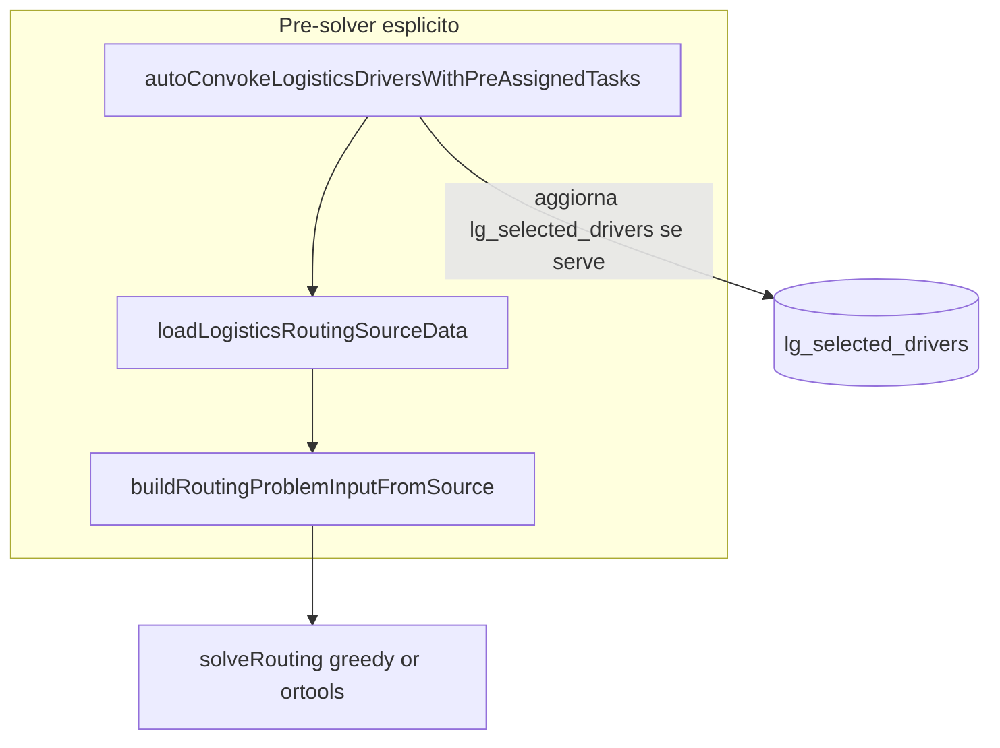

# Auto-convocazione driver pre-assigned (logistics)

## Problema attuale

Oggi il flusso final optimizer carica in parallelo timeline hints e selected drivers in [`loadLogisticsRoutingSourceData`](server/services/logistics-optimizer-final/loaders.ts):

```221:227:server/services/logistics-optimizer-final/loaders.ts
  const [tasks, selectedDrivers, windowConfig, timelineAssignmentHints] = await Promise.all([
    loadUnlockedLogisticsTasks(workDate),
    loadSelectedDrivers(workDate),
    loadWindowConfig(workDate),
    loadTimelineAssignmentHints(workDate),
  ]);
```

Poi [`buildRequiredDriverConstraints`](server/services/logistics-optimizer-final/timeline-assignment-hints.ts) **salta** gli hint se il driver non è tra i selected:

```85:87:server/services/logistics-optimizer-final/timeline-assignment-hints.ts
    if (!schedulableIds.has(hint.taskId) || !driverIds.has(hint.driverId)) {
      skippedHints.push(hint);
      continue;
```

Risultato: task pre-assigned in timeline ma driver non convocato → niente `REQUIRED_DRIVER_TASK`, warning `REQUIRED_DRIVER_TASK_SKIPPED`. Il fallback `REQUIRED_DRIVER_NOT_SELECTED` in OR-Tools resta **safety net** (dati corrotti, race, bug) — non flusso normale.

## Regola di dominio (già chiusa in §22)

```txt
driver con task pre-assigned in logistics timeline
→ implicitamente convocato
→ prima del build del RoutingProblemInput
→ REQUIRED_DRIVER_TASK non viene skippato per driver-not-selected
```

```txt
pre-assigned = task su logistics timeline driver
container-locked = escluso (non in timeline)
free = pool senza vincolo driver
```

- **Nessun readonly** (non portare `preAssignedMode` da housekeeping).
- **Nessun “locked on timeline”**; `task.locked === true` in timeline è solo guard difensivo.
- **Auto-convocazione applicativa**, non nel solver.

## Architettura (approvata)



**Vincoli architetturali (non negoziabili):**

- Auto-convoke **prima** del loader, **non** dentro `loadLogisticsRoutingSourceData`
- **Non** in OR-Tools / `buildRequiredDriverConstraints`
- Side effect esplicito nel caller (`buildLogisticsRoutingInput`), non nascosto
- Merge selected: **existing order + append new driver IDs** (non alterare ordine utente)

Confronto con housekeeping:

| Housekeeping | Logistics (proposta) |
|---|---|
| Rehydrate task da ADAM + auto-convoke cleaner | **Solo** auto-convoke driver da timeline esistente |
| `readonly` / `normal` | Non applicato |
| Side effect esplicito in route/rehydrate | Side effect esplicito prima di `buildLogisticsRoutingInput` |

## Ordine di implementazione (fase 1 — PR unica)

```txt
1. parser condiviso (parsePreAssignedTimelineEntries)
2. auto-convoke module
3. hook esplicito in buildLogisticsRoutingInput
4. metadata + debug
5. test
6. docs §22
7. fase 2 mutation hooks UI → PR separata (dopo M6 apply o subito dopo fase 1)
```

## Nuovo modulo

Creare [`server/services/logistics-optimizer-final/auto-convoke-logistics-drivers.ts`](server/services/logistics-optimizer-final/auto-convoke-logistics-drivers.ts) con:

### 1. Parser puro (condiviso con hints)

Estrarre da [`timeline-assignment-hints.ts`](server/services/logistics-optimizer-final/timeline-assignment-hints.ts) una funzione pura riusabile:

```ts
parsePreAssignedTimelineEntries(timeline): {
  hints: TimelineAssignmentHint[];
  driverIdsWithPreAssignedTasks: number[];
}
```

**Un solo parser** per auto-convoke e `loadTimelineAssignmentHints` — se divergono, bug difficili da leggere.

Logica identica a oggi:
- per ogni `drivers_assignments[].driver.id` valido
- per ogni task con `task_id` valido
- skip `task.locked === true` (guard difensivo §22)
- **non** filtrare per schedulable/coordinate a questo step (convochiamo il driver se ha assignment timeline; task non schedulabili gestiti dal builder/validation)

### 2. Auto-convocazione

```ts
export interface AutoConvokeLogisticsDriversResult {
  workDate: string;
  autoConvokedDriverIds: number[];
  alreadySelectedDriverIds: number[];
  missingInDbDriverIds: number[]; // timeline cita driver assente da lg_drivers
  saved: boolean;
}

export async function autoConvokeLogisticsDriversWithPreAssignedTasks(
  workDate: string,
  options?: {
    performedBy?: string;
    saveSelectedDrivers?: boolean; // default true — NON usare "dryRun" (confonde con run-dry optimizer)
  }
): Promise<AutoConvokeLogisticsDriversResult>
```

Passi:
1. `loadLogisticsTimeline(workDate)`
2. `parsePreAssignedTimelineEntries` → set driver IDs
3. `loadSelectedLogisticsDrivers(workDate)` → IDs correnti (ordine preservato)
4. `missing = timelineDriverIds - selectedIds`
5. Se `missing` vuoto → return early (`saved: false`)
6. `loadLgDriversByIds(missing, workDate)` via [`pgDailyAssignmentsService`](server/services/pg-daily-assignments-service.ts)
7. Merge selected: **existing order + append new IDs**
8. Enrich driver payload come in [`POST /api/save-selected-logistics-drivers`](server/routes.ts) (start/end da row PG, default `10:00`/`20:00`)
9. Se `saveSelectedDrivers !== false`: `saveSelectedLogisticsDrivers(..., 'AUTO_CONVOKED_PREASSIGNED')`
10. Return result con `autoConvokedDriverIds` e `missingInDbDriverIds`

Note implementative:
- `saveSelectedDrivers: false` per test unit (calcola merge senza persistere) — **non** chiamarlo `dryRun`
- Driver non trovato in DB → log + `missingInDbDriverIds`, non bloccare l’intero run
- **Mai** side effect dentro `loadLogisticsRoutingSourceData`

## Integrazione (fase 1 — obbligatoria)

### Hook esplicito in buildLogisticsRoutingInput

Estendere [`buildLogisticsRoutingInput`](server/services/logistics-optimizer-final/build-routing-input.ts) (nome ok se options documentano il side effect; alternativa futura: alias `prepareLogisticsRoutingInput`):

```ts
export interface BuildLogisticsRoutingInputOptions {
  performedBy?: string;
  skipAutoConvoke?: boolean; // per test regressione
  saveSelectedDrivers?: boolean; // default true; pass-through ad auto-convoke
}

export async function buildLogisticsRoutingInput(
  workDate: string,
  options?: BuildLogisticsRoutingInputOptions
): Promise<RoutingProblemInput>
```

Flusso:

```ts
let autoConvokeResult: AutoConvokeLogisticsDriversResult | undefined;
if (!options?.skipAutoConvoke) {
  autoConvokeResult = await autoConvokeLogisticsDriversWithPreAssignedTasks(workDate, {
    performedBy: options?.performedBy ?? 'logistics-optimizer-final',
    saveSelectedDrivers: options?.saveSelectedDrivers,
  });
}
const sourceData = await loadLogisticsRoutingSourceData(workDate);
return buildRoutingProblemInputFromSource(sourceData, { autoConvokeResult });
```

### Propagazione opzioni

- [`run-routing-dry.ts`](server/services/logistics-optimizer-final/run-routing-dry.ts): `performedBy?`, espone `autoConvoke` summary nel result
- [`run-routing-input-debug.ts`](server/services/logistics-optimizer-final/run-routing-input-debug.ts): stesso hook
- [`routes.ts`](server/routes.ts) `POST /api/logistics-optimizer-final/run-dry`: passa `getCurrentUsername(req)` come `performedBy`

### Metadata / debug

Aggiungere a [`RoutingProblemMetadata`](server/services/logistics-optimizer-final/input-contract.ts):

- `autoConvokedDriverIds: number[]`
- `autoConvokedDriversCount: number`
- `autoConvokeMissingInDbDriverIds: number[]`
- `autoConvokeMissingInDbDriversCount: number`

`missingInDb` è segnale operativo: timeline cita driver assente da `lg_drivers`.

Popolati dal result di auto-convoke in `buildMetadata`.

In debug manifest [`debug-writer.ts`](server/services/logistics-optimizer-final/debug-writer.ts): entrambi i conteggi.

## Integrazione (fase 2 — PR separata, parity UI)

Oggi le mutation timeline **non** auto-convocano:
- [`save-logistics-timeline-assignment`](server/logistics-timeline-mutation-routes.ts) crea stub driver anche se non selected
- [`move-task-between-drivers`](server/logistics-timeline-mutation-routes.ts) richiede dest driver già in selected (404 altrimenti)

Dopo fase 1 l’optimizer è corretto; fase 2 evita incoerenze UI fino al prossimo run.

Chiamare helper condiviso (append singolo driver) alla fine di:
- `POST /api/save-logistics-timeline-assignment`
- `POST /api/move-task-between-drivers` (dest driver)
- opzionale: `POST /api/add-driver-to-timeline`

Risposta API: `autoConvokedDrivers: number[]` dove utile.

**Non mischiare fase 1 e fase 2 nella stessa PR** — rischio basso, review più semplice.

## Cosa NON fare

- Nessuna logica in OR-Tools / `ortools-adapter.ts`
- Nessun rehydrate da ADAM
- Nessun `readonly`
- Non rimuovere `REQUIRED_DRIVER_NOT_SELECTED` (safety net)
- Non usare opzione `dryRun` per auto-convoke (ambiguo vs `run-dry` optimizer)

## Test

Nuovo file [`shared/logisticsOptimizerFinalAutoConvoke.test.ts`](shared/logisticsOptimizerFinalAutoConvoke.test.ts):

| Caso | Atteso |
|---|---|
| Driver 8 in timeline con task, selected = [7] | auto-convoke 8, poi `REQUIRED_DRIVER_TASK` per task |
| Driver già selected | `autoConvokedDriverIds = []`, `saved: false` |
| Timeline vuota | no-op |
| Driver in timeline assente da `lg_drivers` | `missingInDbDriverIds` popolato, no crash |
| `skipAutoConvoke: true` | hint skipped per driver-not-selected (regressione) |
| `saveSelectedDrivers: false` | merge calcolato, PG non chiamato |

Integrazione: scenario in [`logisticsOptimizerFinalTimelineHints.test.ts`](shared/logisticsOptimizerFinalTimelineHints.test.ts) — hint skipped senza auto-convoke → REQUIRED creato dopo auto-convoke.

## Documentazione

Aggiornare [`logistics_optimizer_pre_ortools_base.md`](server/services/logistics-optimizer-final/logistics_optimizer_pre_ortools_base.md) §22:

- sottosezione **Auto-convocazione pre-assigned**
- regola operativa (driver timeline → convocato prima del build)
- `REQUIRED_DRIVER_NOT_SELECTED` = safety net
- action type revision: `AUTO_CONVOKED_PREASSIGNED`
- `missingInDb` in metadata come diagnostica operativa

## Criteri di done (fase 1)

- Run dry con task pre-assigned su driver **non selected** produce `REQUIRED_DRIVER_TASK` valido
- **Zero** `skippedTimelineAssignmentHintsCount` **dovuti a driver non selected** per quel caso (hint skippati per task non schedulabili / locked / no coordinate restano legittimi)
- `lg_selected_drivers` persistito con revision trail quando `saveSelectedDrivers` true
- Metadata espone `autoConvoked*` e `autoConvokeMissingInDb*`
- Test verdi
- OR-Tools/greedy invariati (solo input più coerente)

## Posizione nella roadmap

Correzione giusta **prima di M6 apply**:

```txt
M5 OR-Tools risolve bene
→ auto-convoke rende coerente l’input
→ M6 apply timeline
→ fase 2 mutation hooks (parity UI)
```
