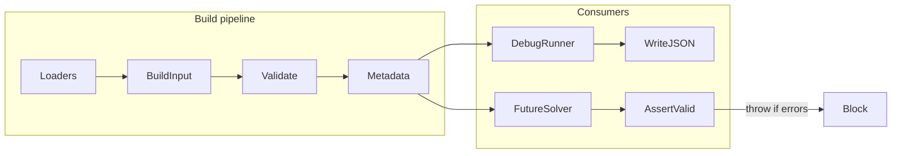

# Milestone 2 — RoutingProblemInput validato

## Obiettivo

`RoutingProblemInput` deve diventare un input **validato, spiegabile e sicuro**. Se invalido, il futuro solver non deve partire. Per ora il debug runner continua a scrivere JSON anche quando invalido.



**Confine corretto:** validazione forte prima del solver, nessun OR-Tools ancora.

**Stato:** approvato — pronto da implementare senza ulteriori modifiche sostanziali.

---

## Ordine operativo (18 step)

Implementare in questo ordine, senza cambiare scope:

```txt
 1. .gitignore
 2. validation-contract.ts
 3. input-contract.ts
 4. validation.ts con helper + formatValidationIssue
 5. validator schema/depot
 6. validator drivers
 7. validator tasks + service duration
 8. validator hard constraints
 9. validator soft constraints
10. validator travel matrix
11. validator metadata/exclusions/warnings
12. assertRoutingProblemInputValid
13. debug-writer manifest
14. run-routing-input-debug result
15. CLI output
16. test dedicati
17. aggiornamento test esistenti
18. run reale con JSON
```

---

## Check pre-implementazione

[`shared/logistics-scheduling-constraints.ts`](shared/logistics-scheduling-constraints.ts) esporta già:

```ts
export const LOGISTICS_SERVICE_DURATION_MIN = 15;
```

Usare **solo** questa costante in `validation.ts` e nei test — mai `15` hardcoded, mai una costante locale in `validation.ts`.

```ts
import { LOGISTICS_SERVICE_DURATION_MIN } from "../../../shared/logistics-scheduling-constraints";
```

(path relativo corretto per file in `server/services/logistics-optimizer-final/`)

---

## Regola anti-duplicazione errori (validator)

Evitare errori a cascata derivati dallo stesso problema root.

**Esempio:** `task.nodeIndex = 999` non deve generare sia `INVALID_NODE_INDEX` sia `INVALID_TRAVEL_MATRIX_SIZE`.

**Regola pratica:**

```txt
task.nodeIndex invalido     → INVALID_NODE_INDEX (sezione task, prima)
matrix dimensione errata    → INVALID_TRAVEL_MATRIX_SIZE (solo errori strutturali matrice)
matrix valori errati        → INVALID_TRAVEL_MATRIX_VALUE
```

La validazione travel matrix deve controllare forma/dimensione/valori della matrice **come struttura**, non ri-segnalare problemi già coperti da `INVALID_NODE_INDEX` sui task. Se i task hanno nodeIndex invalidi, la sezione matrix può saltare controlli derivati (o limitarsi a errori intrinseci della matrice stessa).

---

## Fase 0 — Micro-pulizia (chiude Milestone 1)

### 0.1 `.gitignore`

In [`.gitignore`](.gitignore), sostituire la regola parziale con:

```gitignore
server/debug/
```

(rimuovere `server/debug/logistics-optimizer/` ridondante)

### 0.2 Verifica endpoint `debug` omesso

In [`server/routes.ts`](server/routes.ts) (handler `POST /api/logistics-optimizer-final/routing-input-debug`) il comportamento è già corretto: `hasDebugBody` → `debugExplicit = undefined` se omesso.

**Azione:** verificare con una chiamata `{ "date": "..." }` senza `debug` che scriva JSON in dev; se ok, nessuna modifica codice.

---

## Fase 1 — Contratto validation

### Nuovo file: [`server/services/logistics-optimizer-final/validation-contract.ts`](server/services/logistics-optimizer-final/validation-contract.ts)

Tipi condivisi (nessuna logica):

- `ValidationSeverity = "error" | "warning"`
- `ValidationIssueCode` — union completa:

```ts
| "UNSUPPORTED_SCHEMA_VERSION"
| "NO_SELECTED_DRIVERS"
| "PRIORITY_WINDOWS_UNAVAILABLE"
| "LOCKED_ASSIGNMENTS_NOT_SOLVER_INTEGRATED"
| "INVALID_DEPOT_NODE"
| "DUPLICATE_DRIVER_ID"
| "INVALID_DRIVER_WORK_WINDOW"
| "MISSING_DRIVER_WORK_WINDOW_CONSTRAINT"
| "DUPLICATE_TASK_ID"
| "DUPLICATE_NODE_INDEX"
| "INVALID_NODE_INDEX"
| "TASK_INCLUDED_BUT_UNSCHEDULABLE"
| "INVALID_TASK_COORDINATES"
| "INVALID_TASK_HARD_WINDOW"
| "TASK_SERVICE_EXCEEDS_WINDOW"
| "INVALID_TASK_SERVICE_DURATION"
| "MISSING_TASK_TIME_WINDOW_CONSTRAINT"
| "MISSING_TASK_REQUIRED_CONSTRAINT"
| "UNKNOWN_TASK_IN_CONSTRAINT"
| "UNKNOWN_DRIVER_IN_CONSTRAINT"
| "INVALID_HARD_CONSTRAINT"
| "DUPLICATE_HARD_CONSTRAINT"
| "INVALID_SOFT_CONSTRAINT"
| "INVALID_TRAVEL_MATRIX_SIZE"
| "INVALID_TRAVEL_MATRIX_VALUE"
| "INVALID_EXCLUDED_TASK_REASON"
| "EXCLUDED_TASK_COUNT_MISMATCH"
| "METADATA_CONSISTENCY_MISMATCH"
```

- `ValidationIssue` con campi `code`, `severity`, `message`, `path?`, `taskId?`, `driverId?`, `nodeIndex?`, `expected?`, `actual?`
- `RoutingProblemValidationResult { valid, errors: ValidationIssue[], warnings: ValidationIssue[] }`

**Codici aggiunti rispetto al piano iniziale:**

- `DUPLICATE_HARD_CONSTRAINT` — quando un task/driver ha più di 1 constraint dello stesso tipo (es. 2 `TASK_REQUIRED` per lo stesso task). Issue con `expected: 1`, `actual: N`.
- `INVALID_HARD_CONSTRAINT` — quando il constraint esiste ma non coincide con `task.hardWindow` / `driver.workWindow` (problema nel vincolo, non nel task/driver).
- `INVALID_NODE_INDEX` — `nodeIndex` fuori range o buchi nella sequenza compatta.

### Aggiornare [`server/services/logistics-optimizer-final/input-contract.ts`](server/services/logistics-optimizer-final/input-contract.ts)

```ts
validation: RoutingProblemValidationResult;
```

(import solo tipi da `validation-contract.ts`)

### Aggiornare [`server/services/logistics-optimizer-final/validation.ts`](server/services/logistics-optimizer-final/validation.ts)

- Rimuovere `RoutingProblemValidationResult` locale → import da `validation-contract.ts`
- Esportare `validateRoutingProblemInput`, `assertRoutingProblemInputValid`, `formatValidationIssue`

### Aggiornare [`server/services/logistics-optimizer-final/index.ts`](server/services/logistics-optimizer-final/index.ts)

Esportare `validation-contract` (tipi) se necessario ai consumer esterni.

---

## Fase 2 — Validator forte (rewrite `validation.ts`)

### Helper interni

- `pushError`, `pushWarning`
- `isFiniteNumber`, `isValidMinute` (range `0..1440` per dominio giornaliero)
- `formatValidationIssue(issue)` — formattazione condivisa per assert, CLI, future API:

```ts
export function formatValidationIssue(issue: ValidationIssue): string {
  const target =
    issue.taskId !== undefined
      ? ` taskId=${issue.taskId}`
      : issue.driverId !== undefined
        ? ` driverId=${issue.driverId}`
        : issue.nodeIndex !== undefined
          ? ` nodeIndex=${issue.nodeIndex}`
          : "";
  return `${issue.code}${target}: ${issue.message}`;
}
```

Opzionale: file separato `validation-format.ts` — non necessario se resta in `validation.ts`.

### Sezioni del validator (un unico commit logico)

| Sezione | Controlli principali | Codici |
|---------|---------------------|--------|
| **Schema/depot** | `schemaVersion`, depot `nodeIndex === 0`, coordinate finite, array non-null | `UNSUPPORTED_SCHEMA_VERSION`, `INVALID_DEPOT_NODE` |
| **Driver** | id unico, `selected === true`, workWindow finita e `startMin < endMin`, sources valorizzati | `DUPLICATE_DRIVER_ID`, `INVALID_DRIVER_WORK_WINDOW` |
| **Driver constraints** | esattamente 1 `DRIVER_WORK_WINDOW` per driver; se >1 → `DUPLICATE_HARD_CONSTRAINT`; se valori ≠ `driver.workWindow` → `INVALID_HARD_CONSTRAINT`; riferimenti orfani → `UNKNOWN_DRIVER_IN_CONSTRAINT` | `MISSING_*`, `DUPLICATE_*`, `INVALID_HARD_CONSTRAINT`, `UNKNOWN_*` |
| **Task** | taskId unico, nodeIndex unico, `nodeIndex` in `1..tasks.length` (sequenza compatta, no buchi), coord finite e in range, `eligibility.schedulable`, hardWindow coerente | `DUPLICATE_*`, `INVALID_NODE_INDEX`, `INVALID_TASK_*` |
| **Task constraints** | esattamente 1 `TASK_TIME_WINDOW` + 1 `TASK_REQUIRED` per task; duplicati → `DUPLICATE_HARD_CONSTRAINT`; mismatch con `task.hardWindow` → `INVALID_HARD_CONSTRAINT` | `MISSING_*`, `DUPLICATE_*`, `INVALID_HARD_CONSTRAINT`, `UNKNOWN_*` |
| **Soft constraints** | pesi validi, `PREFERRED_PRIORITY_WINDOW` riferisce task esistente, finestre finite | `INVALID_SOFT_CONSTRAINT`, `UNKNOWN_TASK_IN_CONSTRAINT` |
| **Travel matrix** | size = `tasks.length + 1` (valido perché nodeIndex è compatto `0..tasks.length`), quadrata, valori finiti `>= 0`, diagonale = 0, no simmetria richiesta. Vedi regola anti-duplicazione errori | `INVALID_TRAVEL_MATRIX_SIZE`, `INVALID_TRAVEL_MATRIX_VALUE` |
| **Metadata/exclusions** | `excludedTasks` reason ammessa, no duplicati su `taskId` | `INVALID_EXCLUDED_TASK_REASON` |
| **Metadata consistency** | conteggi coerenti (vedi sotto) | `EXCLUDED_TASK_COUNT_MISMATCH`, `METADATA_CONSISTENCY_MISMATCH` come **warning** |
| **Warnings** | `NO_SELECTED_DRIVERS`, `PRIORITY_WINDOWS_UNAVAILABLE`, opz. `LOCKED_ASSIGNMENTS_NOT_SOLVER_INTEGRATED` | vedi sotto |

### Regola `serviceDurationMin`

**Premessa:** `input.tasks` contiene solo task logistica da `lg_containers`. Housekeeping durata 0 non entra nel routing input. `cleaningTime` influenza solo finestre (`DRIVER_BRINGS_BAG`).

**Mai hardcodare `15`** — usare sempre `LOGISTICS_SERVICE_DURATION_MIN` da [`shared/logistics-scheduling-constraints.ts`](shared/logistics-scheduling-constraints.ts) in:

- `build-routing-input.ts` (già così)
- `validation.ts`
- test

**Due livelli di validazione:**

1. **Globale (errore):** `input.serviceDurationMin !== LOGISTICS_SERVICE_DURATION_MIN` → `INVALID_TASK_SERVICE_DURATION` con `path: "serviceDurationMin"`
2. **Per task (errore):** `task.serviceDurationMin !== input.serviceDurationMin` → `INVALID_TASK_SERVICE_DURATION` con `taskId`, `expected`/`actual`
3. **Finestra (errore):** `task.hardWindow.latestStartMin + task.serviceDurationMin > task.hardWindow.latestEndMin` → `TASK_SERVICE_EXCEEDS_WINDOW` (fix bug riga 57 attuale che usa `input.serviceDurationMin`)

### `NO_SELECTED_DRIVERS` — warning in M2, blocking in futuro

In Milestone 2: **warning**, non errore — permette debug input senza driver.

Aggiungere commento in `validation.ts`:

```ts
// NO_SELECTED_DRIVERS is a warning in debug mode.
// Future solver entrypoint must treat this as blocking
// (or assertRoutingProblemInputValid should support mode: "debug" | "solver").
```

Non implementare `ValidationMode` ora — solo nota per il futuro.

### Metadata count mismatch — warning, non errore

Inizialmente come **warning** (non bloccano il solver su dati derivati):

- `lockedTasksExcluded === count(excludedTasks where reason=LOCKED)`
- `tasksExcludedNoCoordinatesCount === count(excludedTasks where reason=NO_COORDINATES)`
- `existingLockedAssignmentsCount === existingLockedAssignments.length`
- `noSelectedDrivers` coerente con `drivers.length === 0`

Codice: `EXCLUDED_TASK_COUNT_MISMATCH` o `METADATA_CONSISTENCY_MISMATCH`, severity `warning`.

### Travel matrix e nodeIndex compatto

[`build-routing-input.ts`](server/services/logistics-optimizer-final/build-routing-input.ts) assegna `nodeIndex = index + 1` progressivo. Il validator deve esplicitare:

- `depot.nodeIndex === 0`
- ogni `task.nodeIndex` in `1..tasks.length`
- nessun buco nella sequenza

Se `nodeIndex` fuori range → `INVALID_NODE_INDEX` (oltre a `DUPLICATE_NODE_INDEX`).

### `assertRoutingProblemInputValid`

```ts
export function assertRoutingProblemInputValid(input: RoutingProblemInput): void {
  const validation = validateRoutingProblemInput(input);
  if (!validation.valid) {
    const summary = validation.errors.map(formatValidationIssue).join("\n");
    throw new Error(`Invalid RoutingProblemInput:\n${summary}`);
  }
}
```

**Non** usarla nel debug runner. Solo export per il futuro solver.

---

## Fase 3 — Debug e runner

### [`server/services/logistics-optimizer-final/debug-writer.ts`](server/services/logistics-optimizer-final/debug-writer.ts)

Estendere `manifest.json`:

```ts
validation: {
  valid: input.metadata.validation.valid,
  errorCount: input.metadata.validation.errors.length,
  warningCount: input.metadata.validation.warnings.length,
},
counts: {
  drivers: input.drivers.length,
  tasks: input.tasks.length,
  hardConstraints: input.hardConstraints.length,
  softConstraints: input.softConstraints.length,
  existingLockedAssignments: input.metadata.existingLockedAssignmentsCount,
  excludedTasks: input.metadata.excludedTasks.length,
}
```

### [`server/services/logistics-optimizer-final/run-routing-input-debug.ts`](server/services/logistics-optimizer-final/run-routing-input-debug.ts)

Aggiungere al result: `errorCount`, `warningCount`.

### [`scripts/run-logistics-optimizer-final-debug.ts`](scripts/run-logistics-optimizer-final-debug.ts)

Output leggibile usando `formatValidationIssue`:

```
Routing input generated
Date: 2026-06-04
Drivers: 3
Tasks: 42
Validation: valid|invalid
Warnings: N
Errors:
- INVALID_DRIVER_WORK_WINDOW driverId=7: ...
Debug dir: server/debug/logistics-optimizer-final/...
```

Nessun `process.exit(1)` di default.

---

## Fase 4 — Test

### Nuovo file: [`shared/logisticsOptimizerFinalValidation.test.ts`](shared/logisticsOptimizerFinalValidation.test.ts)

Helper `buildMinimalValidInput()` riusando fixture da [`shared/logisticsOptimizerFinal.test.ts`](shared/logisticsOptimizerFinal.test.ts).

| # | Test | Mutazione | Codice atteso |
|---|------|-----------|---------------|
| 1 | input valido | fixture normale | `valid: true`, 0 errors |
| 2 | driver window invalida | `startMin >= endMin` | `INVALID_DRIVER_WORK_WINDOW` |
| 3 | manca DRIVER_WORK_WINDOW | filtra constraints | `MISSING_DRIVER_WORK_WINDOW_CONSTRAINT` |
| 4 | coordinate invalide | `lat = NaN` | `INVALID_TASK_COORDINATES` |
| 5 | hard window invalida | `earliestStart > latestStart` | `INVALID_TASK_HARD_WINDOW` |
| 6 | servizio supera finestra | stringi `latestEndMin` | `TASK_SERVICE_EXCEEDS_WINDOW` |
| 7 | manca TASK_REQUIRED | filtra constraint | `MISSING_TASK_REQUIRED_CONSTRAINT` |
| 8 | matrix size errata | `travelMatrixMin.pop()` | `INVALID_TRAVEL_MATRIX_SIZE` |
| 9 | matrix valore negativo | `[0][1] = -5` | `INVALID_TRAVEL_MATRIX_VALUE` |
| 10 | priority windows null | `priorityWindows = null` | warning `PRIORITY_WINDOWS_UNAVAILABLE`, `valid: true` |
| 11 | serviceDuration incoerente | `task.serviceDurationMin !== input.serviceDurationMin` | `INVALID_TASK_SERVICE_DURATION` |
| 12 | **constraint duplicato** | secondo `TASK_REQUIRED` stesso task | `DUPLICATE_HARD_CONSTRAINT` |
| 13 | **constraint task inesistente** | `TASK_REQUIRED taskId=999999` | `UNKNOWN_TASK_IN_CONSTRAINT` |
| 14 | **constraint mismatch driver** | `DRIVER_WORK_WINDOW` ≠ `driver.workWindow` | `INVALID_HARD_CONSTRAINT` |

Nei test usare `LOGISTICS_SERVICE_DURATION_MIN`, mai `15` letterale.

### Aggiornare [`shared/logisticsOptimizerFinal.test.ts`](shared/logisticsOptimizerFinal.test.ts)

- `expect(input.metadata.validation.valid).toBe(true)` resta valido
- Se compaiono assert su `errors`/`warnings` come stringhe, migrare a `toContainEqual(expect.objectContaining({ code: "..." }))`

---

## Fase 5 — Verifica manuale

```bash
npm test -- shared/logisticsOptimizerFinal.test.ts shared/logisticsOptimizerFinalValidation.test.ts
npx tsx scripts/run-logistics-optimizer-final-debug.ts 2026-06-04 --debug
```

Controllare:
- `server/debug/logistics-optimizer-final/{date}/{runId}/manifest.json` → validation summary
- `01-routing-input.json` → `metadata.validation.errors/warnings` come issue strutturate

---

## Fuori scope (non toccare)

- `solution-contract.ts`, apply, OR-Tools, solver Python
- Locked assignments come vincoli solver (restano `metadata.existingLockedAssignments`, `lockedAssignmentsSolverIntegration: "pending"`)
- Esclusioni `reason: "INVALID_WINDOW"` (task invalidi restano in `input.tasks` con errori validator)
- `ValidationMode: "debug" | "solver"` (solo nota commento, non implementare ora)

---

## Definition of Done

1. `validateRoutingProblemInput` produce `ValidationIssue[]` con `code` stabili
2. Driver, task, hard/soft constraints, travel matrix, exclusions validati
3. `DUPLICATE_HARD_CONSTRAINT` e `INVALID_HARD_CONSTRAINT` coprono vincoli duplicati e mismatch
4. `serviceDurationMin` validato via `LOGISTICS_SERVICE_DURATION_MIN` (globale + per-task + finestra)
5. `nodeIndex` compatto `1..tasks.length` validato esplicitamente
6. Metadata count mismatch come warning, non errore
7. `formatValidationIssue` usato in assert e CLI
8. Manifest debug include validation summary + counts
9. 14 test dedicati (inclusi duplicati, orfani, mismatch constraint)
10. Run reale genera JSON leggibile
11. `server/debug/` in gitignore
12. Nessun solver collegato
