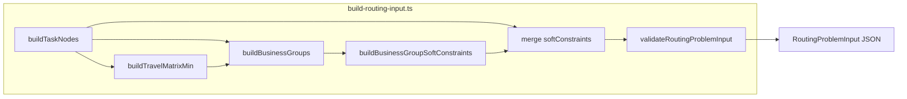

# Milestone 3 — Business Groups & Declarative Soft Constraints

## Obiettivo

Arricchire [`RoutingProblemInput`](server/services/logistics-optimizer-final/input-contract.ts) con `businessGroups` e 5 nuovi tipi in `SoftConstraintSpec`, generati dai task schedulabili (locked esclusi a loader). Nessun hard constraint, nessuna assegnazione driver, nessun solver.



---

## Correzioni concordate (rispetto al piano originale)

Queste sostituiscono le decisioni iniziali (20m, 300m, 30min, group-by-cleanerId):

| # | Argomento | Prima | Dopo |
|---|---|---|---|
| 1 | `SAME_COORDINATES_BUILDING` | 20m haversine | **100m** haversine, union-find transitivo, resta in **metri** |
| 2 | `NEARBY_CLUSTER` | 300m centroide haversine | **`maxTravelMin: 10`** via **`travelMatrixMin`**, hub model, `source: "travel_matrix"` |
| 3 | `PRIORITY_COMPATIBLE` | overlap ≥ 30 min | overlap comune ≥ **45 min** (no bucket) |
| 4 | `SAME_CLEANER` | group by solo `cleanerId` | solo **`hasCleanerAssignment`** (`cleanerId` + `cleanerSequence`) |
| 5 | Task non assegnati | implicitamente in SAME_CLEANER | **no** cleaner groups; **sì** geo/travel/priority (vedi matrice sotto) |
| 6 | Pipeline | `buildBusinessGroups(tasks)` | `buildBusinessGroups(tasks, travelMatrixMin)` dopo matrice |
| 7 | Contratto nearby | `radiusMeters` | **`maxTravelMin`** su gruppo + soft constraint |

### Helper condiviso — elegibilità cleaner

```ts
function hasCleanerAssignment(task: TaskNode): boolean {
  return (
    task.groupingHints.cleanerId != null &&
    task.groupingHints.cleanerSequence != null
  );
}
```

Allineato a Phase 2 [`isCleanerEligibleTask`](server/services/logistics-optimizer/phase2.ts) e [`bag-handling.ts`](server/services/logistics-optimizer-final/bag-handling.ts) (`NO_CLEANER_CONTEXT` senza sequence).

### Matrice elegibilità task non assegnati

| Builder | Non assegnati | Mix con assegnati |
|---|---|---|
| `SAME_CLEANER` | No | No |
| `CLEANER_SEQUENCE` | No | No |
| `SAME_COORDINATES_BUILDING` | Sì | Sì (stesso edificio/GPS) |
| `NEARBY_CLUSTER` | Sì | Sì (travel hub ≤ 10 min) |
| `PRIORITY_COMPATIBLE` | Sì | Sì (check-in/check-out, overlap ≥ 45 min) |

---

## Decisioni tecniche (definitive)

| Builder | Algoritmo | Unità | Weight |
|---|---|---|---|
| `SAME_COORDINATES_BUILDING` | Union-find transitivo se haversine ≤ **100m** | metri | 100 |
| `NEARBY_CLUSTER` | Greedy per `taskId`, **hub model**: seed = primo task; membro ok se `travelMatrixMin[hub][t] ≤ 10` per tutti | **minuti** (matrice) | 15 |
| `PRIORITY_COMPATIBLE` | Overlap **comune** start: `max(earliestStartMin)` … `min(latestStartMin)` ≥ **45 min**; validare intersezione del cluster intero (no bucket, no transitività cieca a coppie) | minuti | 20 |
| `CLEANER_SEQUENCE` | Solo `debug.sourceTimes.cleanerTaskStartMin`; `taskIds === orderedTaskIds`; ordine: startMin → `cleanerSequence` → `taskId` | — | 40 |
| `SAME_CLEANER` | Solo `hasCleanerAssignment`; group by `cleanerId`; size ≥ 2 | — | 30 |

**Perché metri per coordinates e minuti per nearby:** same-building = identità del luogo (GPS sporco); nearby = costo operativo route — stessa lingua di `travelMatrixMin` e legacy `GEO_FALLBACK_MAX_RADIUS_TRAVEL_MIN = 10`.

---

## Step 1–3 — Contratti e pesi

### 1. [`groups/group-contract.ts`](server/services/logistics-optimizer-final/groups/group-contract.ts) (nuovo)

Tipi: `BusinessGroupType`, `BusinessGroupConfidence`, `BaseBusinessGroup`, 5 interfacce, union `RoutingBusinessGroup`.

**Aggiornamento contratto `NearbyClusterGroup`:**

```ts
// NON radiusMeters — usare:
maxTravelMin: number;
source: "travel_matrix";
```

Soft constraint `KEEP_NEARBY_CLUSTER_TOGETHER`: `maxTravelMin` (non `radiusMeters`).

### 2. [`input-contract.ts`](server/services/logistics-optimizer-final/input-contract.ts)

- `businessGroups: RoutingBusinessGroup[]` (sempre array, anche `[]`)
- Estendere **`SoftConstraintSpec`** (non `RoutingSoftConstraint`) con 5 tipi `KEEP_*`

### 3. [`groups/group-weights.ts`](server/services/logistics-optimizer-final/groups/group-weights.ts) (nuovo)

```ts
export const BUSINESS_GROUP_WEIGHTS = {
  KEEP_SAME_COORDINATES_BUILDING_TOGETHER: 100,
  KEEP_CLEANER_SEQUENCE: 40,
  KEEP_SAME_CLEANER_TASKS_TOGETHER: 30,
  KEEP_PRIORITY_COMPATIBLE_TASKS_TOGETHER: 20,
  KEEP_NEARBY_CLUSTER_TOGETHER: 15,
} as const;

export const BUSINESS_GROUP_THRESHOLDS = {
  SAME_COORDINATES_BUILDING_TOLERANCE_METERS: 100,
  NEARBY_CLUSTER_MAX_TRAVEL_MIN: 10,
  PRIORITY_COMPATIBLE_MIN_OVERLAP_MIN: 45,
} as const;
```

---

## Step 4 — Geo utils condivise

### [`groups/geo-utils.ts`](server/services/logistics-optimizer-final/groups/geo-utils.ts) (nuovo)

Per **same-coordinates** e helper generici (non per nearby):

- `haversineMeters(...)` — adattare da [`logistics-timeline-utils.ts`](server/services/logistics-timeline-utils.ts)
- `calculateCentroid(...)`, `maxDistanceFromCentroid(...)` — solo se utili per same-coordinates
- `unionFindGroups(items, shouldUnion)` — riusabile da same-coordinates; priority usa validazione overlap comune del componente

**Nearby non usa haversine/centroide** — solo `travelMatrixMin` + `task.nodeIndex`.

---

## Step 5–9 — Group builders

### 5. `same-coordinates-building-groups.ts`

- Task con coordinate finite
- Union-find: edge se haversine ≤ **100m**
- Gruppo se size ≥ 2
- `toleranceMeters: 100`; `confidence: "high"`; `source: "coordinates"`
- Commento: *transitive closure over coordinates within 100 meters*
- Sostituisce same address / building / ADAM — **mix assegnati/non assegnati ok**

### 6. `same-cleaner-groups.ts`

- Filtra **`hasCleanerAssignment(task)`** — non solo `cleanerId`
- Group by `cleanerId`; size ≥ 2
- `groupId`: `same-cleaner:<cleanerId>`; `confidence: "medium"`; `source: "cleaner_id"`
- Task senza sequence → **esclusi** (possono entrare solo in geo/travel/priority)

### 7. `cleaner-sequence-groups.ts`

- Group by `cleanerId`; solo task con `debug.sourceTimes.cleanerTaskStartMin` valido
- `taskIds === orderedTaskIds`; ordine: startMin → `cleanerSequence` → `taskId`
- Size ≥ 2; `confidence: "high"`; `source: "cleaner_task_start_time"`

### 8. `priority-compatible-groups.ts`

- Overlap comune start window per cluster intero:
  - `overlapStart = max(earliestStartMin)`
  - `overlapEnd = min(latestStartMin)`
  - valido se `overlapEnd - overlapStart >= 45`
- Greedy o union-find + **validazione overlap comune del componente** prima di emettere (evita A–B + B–C senza overlap trio)
- `windowOverlap` = intersezione comune del cluster
- **Mix assegnati/non assegnati ok**; niente bucket

### 9. `nearby-cluster-groups.ts`

- Input: `tasks` + **`travelMatrixMin`**
- Task con coordinate valide (`nodeIndex` per indice matrice)
- Greedy stabile per `taskId`:
  1. seed = primo task non clusterizzato
  2. prova ad aggiungere task in ordine `taskId`
  3. accetta solo se `travelMatrixMin[hubNode][memberNode] ≤ 10` per **ogni** membro (hub = seed)
  4. gruppo se size ≥ 2
- `maxTravelMin: 10`; `confidence: "medium"`; `source: "travel_matrix"`
- NO hard constraints / esclusioni / assegnazioni / zone rigide
- **Mix assegnati/non assegnati ok**

---

## Step 10 — Orchestratore

### [`groups/build-business-groups.ts`](server/services/logistics-optimizer-final/groups/build-business-groups.ts)

```ts
buildBusinessGroups(tasks: TaskNode[], travelMatrixMin: number[][]): RoutingBusinessGroup[]
buildBusinessGroupSoftConstraints(groups: RoutingBusinessGroup[]): SoftConstraintSpec[]
```

Esportare anche `hasCleanerAssignment` da modulo condiviso (es. `groups/task-eligibility.ts` o in `geo-utils`/dedicated file).

Ordine: SAME_COORDINATES → SAME_CLEANER → CLEANER_SEQUENCE → PRIORITY_COMPATIBLE → NEARBY_CLUSTER.

---

## Step 11 — Integrazione pipeline

[`build-routing-input.ts`](server/services/logistics-optimizer-final/build-routing-input.ts):

```ts
const { tasks, hardConstraints, softConstraints: taskSoftConstraints } = buildTaskNodes(...);
const nodes = buildLocationNodes(tasks);
const travelMatrixMin = buildTravelMatrixMin(nodes);
const businessGroups = buildBusinessGroups(tasks, travelMatrixMin);
const businessSoftConstraints = buildBusinessGroupSoftConstraints(businessGroups);

return {
  ...
  tasks,
  travelMatrixMin,
  hardConstraints: [...],
  softConstraints: [...taskSoftConstraints, ...businessSoftConstraints],
  businessGroups,
  ...
};
input.metadata.validation = validateRoutingProblemInput(input);
```

---

## Step 12–13 — Validator

### [`validation-contract.ts`](server/services/logistics-optimizer-final/validation-contract.ts)

Codici: `INVALID_BUSINESS_GROUP`, `UNKNOWN_TASK_IN_BUSINESS_GROUP`, `DUPLICATE_BUSINESS_GROUP_ID`, `UNKNOWN_BUSINESS_GROUP_IN_CONSTRAINT`.

### [`validation.ts`](server/services/logistics-optimizer-final/validation.ts)

- `businessGroups must be array`
- `validateBusinessGroups` prima di soft constraints
- Estendere `validateSoftConstraints` per `KEEP_*`

| Tipo | Validazione extra |
|---|---|
| `SAME_COORDINATES_BUILDING` | `toleranceMeters > 0` (atteso 100); centro valido |
| `SAME_CLEANER` | `cleanerId` finito |
| `CLEANER_SEQUENCE` | `orderedTaskIds.length >= 2`; `taskIds === orderedTaskIds`; no duplicati |
| `PRIORITY_COMPATIBLE` | `windowOverlap` valido; overlap ≥ **45** coerente col gruppo |
| `NEARBY_CLUSTER` | **`maxTravelMin > 0`** (atteso 10) — non `radiusMeters` |

Soft `KEEP_*`: `groupId` esiste; `weight > 0`; campi coerenti col gruppo (`maxTravelMin`, `windowOverlap`, ecc.).

---

## Step 14–15 — Debug e CLI

[`debug-writer.ts`](server/services/logistics-optimizer-final/debug-writer.ts): `businessGroups`, `businessSoftConstraints`, `businessGroupsByType`.

[`run-routing-input-debug.ts`](server/services/logistics-optimizer-final/run-routing-input-debug.ts) + [`scripts/run-logistics-optimizer-final-debug.ts`](scripts/run-logistics-optimizer-final-debug.ts): summary per tipo.

---

## Step 16–18 — Test

### [`shared/logisticsOptimizerFinalGroups.test.ts`](shared/logisticsOptimizerFinalGroups.test.ts) (nuovo)

Casistica aggiornata:

1. Same coordinates entro 100m
2. **Transitivo** A–B–C (100m)
3. Task lontani → 0 gruppo coordinates
4. Same cleaner solo con `cleanerId` + `cleanerSequence`
5. **Stesso cleanerId senza sequence → 0 SAME_CLEANER**
6. Assigned + unassigned vicini → coordinates/nearby sì; cleaner groups no
7. Cleaner sequence ordine per `cleanerTaskStartMin`
8. Sequence ignora task senza start time
9. Priority overlap comune ≥ **45 min**
10. Priority overlap < 45 o trio transitivo senza overlap comune → no gruppo
11. **Non assegnato + assegnato** con overlap ≥ 45 → priority sì
12. Nearby hub ≤ 10 min via matrice
13. Nearby catena lunga → **no** mega-gruppo
14. `buildBusinessGroups([])` / 1 task
15. `buildBusinessGroupSoftConstraints` mapping corretto (`maxTravelMin` su nearby)

### Validation + existing tests

Come nel piano originale, aggiornati a `maxTravelMin` e soglie 100/45/10.

---

## Step 19–20 — Verifica

```bash
npm test -- shared/logisticsOptimizerFinal.test.ts shared/logisticsOptimizerFinalValidation.test.ts shared/logisticsOptimizerFinalGroups.test.ts
npx tsx scripts/run-logistics-optimizer-final-debug.ts 2026-06-04 --debug
```

---

## Definition of Done (aggiornato)

1. `businessGroups` sempre presente nel JSON
2. 5 builder implementati con regole definitive sopra
3. Same address/building/ADAM → `SAME_COORDINATES` a **100m**
4. Nearby via **`travelMatrixMin`**, **`maxTravelMin: 10`**, hub model
5. Priority overlap comune ≥ **45 min**, no bucket
6. `SAME_CLEANER` solo `hasCleanerAssignment`; sequence solo con `cleanerTaskStartMin`
7. Task non assegnati: geo/travel/priority sì; cleaner no
8. Solo soft `KEEP_*`; mai hard / assign / exclude
9. Validator + manifest + CLI + test + run debug reale
10. Nessun OR-Tools; pre-assegnati non toccati

## Fuori scope

OR-Tools, solver, apply, pre-assegnati, locked policy solver, rebalancing, ottimizzazione rotte.
