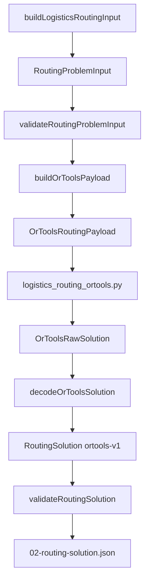

# Milestone 5 — OR-Tools Routing Solver (piano corretto)

## Obiettivo

Solver plug-in dietro `RoutingProblemInput` / `RoutingSolution`, stesso flusso di `run-dry` oggi ma con `solver: "ortools-v1"` opt-in:



**Fuori scope M5:** apply timeline/DB, endpoint `/run`, soft M5b (cleaner/sequence/priority).

---

## Decisioni architetturali

| Decisione | Scelta |
|-----------|--------|
| Runtime | Python + OR-Tools Routing (`pywrapcp.routing`), pattern [`phase2OrTools.ts`](server/services/optimizer/phase2OrTools.ts) |
| Adapter | TS encode + decode; Python solo modello + solve |
| Node index | Riusa `task.nodeIndex` + `input.travelMatrixMin` ([`travel-matrix.ts`](server/services/logistics-optimizer-final/travel-matrix.ts)) |
| Matrici | **`travelMatrixMin`** (originale, per decode/validation) + **`costMatrixMin`** (shaped per objective OR-Tools) |
| Soft M5 | GEO via **cost shaping locale** (archi intra-gruppo), non split-penalty globale same-vehicle |
| Soft M5b | `KEEP_SAME_CLEANER`, `KEEP_CLEANER_SEQUENCE`, `KEEP_PRIORITY_COMPATIBLE` |
| Default `run-dry` | `solver: "greedy-v1"` invariato |
| Body API | Solo `"greedy-v1"` \| `"ortools-v1"` — nessun alias `"ortools"` |
| Status M5 | `FEASIBLE` \| `PARTIAL` \| `INFEASIBLE` \| `INVALID` — **no `OPTIMAL`** in M5 |

---

## Known limitations M5

- Soft GEO = cost shaping locale su archi; **non** garanzia globale che tutti i task di un gruppo finiscano sullo stesso veicolo.
- Cleaner / sequence / priority soft restano in M5b.
- Nessun apply timeline / DB write.
- Required infeasible → `RoutingSolution` con `status: INVALID` diagnostico, **non** errore tecnico HTTP 500.
- `run-dry` default resta `greedy-v1`.
- Decode e validation usano sempre `input.travelMatrixMin` originale, non `costMatrixMin`.

---

## Struttura file

| Azione | File |
|--------|------|
| Nuovo | [`solver/routing-solver-contract.ts`](server/services/logistics-optimizer-final/solver/routing-solver-contract.ts) |
| Nuovo | [`solver/solve-routing.ts`](server/services/logistics-optimizer-final/solver/solve-routing.ts) |
| Nuovo | [`solver/ortools/ortools-adapter.ts`](server/services/logistics-optimizer-final/solver/ortools/ortools-adapter.ts) |
| Nuovo | [`solver/ortools/ortools-routing-solver.ts`](server/services/logistics-optimizer-final/solver/ortools-routing-solver.ts) |
| Nuovo | [`solver/ortools/required-infeasible.ts`](server/services/logistics-optimizer-final/solver/ortools/required-infeasible.ts) — fallback diagnostico |
| Nuovo | [`solver/ortools/logistics_routing_ortools.py`](server/services/logistics-optimizer-final/solver/ortools/logistics_routing_ortools.py) |
| Nuovo | [`shared/logisticsOptimizerFinalOrTools.test.ts`](shared/logisticsOptimizerFinalOrTools.test.ts) |
| Modifica | [`solution-contract.ts`](server/services/logistics-optimizer-final/solution-contract.ts), [`solution-validation.ts`](server/services/logistics-optimizer-final/solution-validation.ts) |
| Modifica | [`run-routing-dry.ts`](server/services/logistics-optimizer-final/run-routing-dry.ts), [`routes.ts`](server/routes.ts) |
| Modifica | [`scripts/copy-optimizer-python.js`](scripts/copy-optimizer-python.js), [`logistics_optimizer_pre_ortools_base.md`](server/services/logistics-optimizer-final/logistics_optimizer_pre_ortools_base.md) |

---

## 1. Solver interface

[`solver/routing-solver-contract.ts`](server/services/logistics-optimizer-final/solver/routing-solver-contract.ts):

```ts
export type RoutingSolverId = "greedy-v1" | "ortools-v1";
```

[`solver/solve-routing.ts`](server/services/logistics-optimizer-final/solver/solve-routing.ts): dispatcher unico. Aggiungere `ORTOOLS_SOLVER_ID = "ortools-v1"` in [`solution-contract.ts`](server/services/logistics-optimizer-final/solution-contract.ts).

---

## 2. Encode — `buildOrToolsPayload`

### Mappe

- `taskId ↔ nodeIndex` da `task.nodeIndex`
- `driverId ↔ vehicleIndex` da `drivers` sorted by `id` asc

### Payload

```ts
interface OrToolsRoutingPayload {
  schemaVersion: "logistics-ortools-payload/v1";
  workDate: string;
  travelMatrixMin: number[][];   // originale — reference per decode
  costMatrixMin: number[][];     // shaped per objective (soft GEO)
  nodes: Array<{ nodeIndex: number; kind: "DEPOT" | "TASK"; taskId?: number }>;
  vehicles: Array<{ vehicleIndex: number; driverId: number; startMin: number; endMin: number }>;
  tasks: Array<{
    taskId: number;
    nodeIndex: number;
    serviceDurationMin: number;  // per-task (oggi uniforme, future-proof)
    priority: "EO" | "HP" | "LP" | null;
    earliestStartMin: number;
    latestStartMin: number;
    latestEndMin: number;
    requiredDriverId?: number;
    dropPenalty: number;
  }>;
  softGeo: {
    sameBuildingGroups: Array<{ groupId: string; taskIds: number[]; weight: number }>;
    nearbyClusterGroups: Array<{ groupId: string; taskIds: number[]; weight: number; maxTravelMin: number }>;
  };
  options: { timeLimitSec: number };
}
```

### Drop policy

| Caso | OR-Tools | Output |
|------|----------|--------|
| Task libero | `AddDisjunction` penalty EO > HP > LP > default | `PARTIAL` se droppato |
| `REQUIRED_DRIVER_TASK` | Hard `VehicleVar.SetValues([vehicleIndex])`, **no disjunction** | Se non assegnabile → `INVALID` + `REQUIRED_DRIVER_INFEASIBLE` |

### Soft GEO — cost shaping (M5)

In `buildCostMatrixMin(travelMatrixMin, softGeo)`:

- Per coppie task nello stesso **same-building** group: ridurre costo arco A→B e B→A (es. `cost = travel - bonus`, floor 0)
- Per coppie **nearby cluster** con `travel <= maxTravelMin`: ridurre costo arco proporzionale a `weight`
- **Non** implementare penalità globale "N veicoli usati dal gruppo"
- Obiettivo: favorire sequenze intra-gruppo e stesso driver quando conviene, senza promettere grouping ottimale

---

## 3. Python solver — modello

File: [`logistics_routing_ortools.py`](server/services/logistics-optimizer-final/solver/ortools/logistics_routing_ortools.py)

### Arc cost callback

Usa **`costMatrixMin`** per l'objective (minimize travel shaped).

### Time dimension (esplicito)

```txt
transit(from, to) = serviceDuration(from) + travelMatrixMin[from][to]
serviceDuration(depot) = 0
serviceDuration(task) = task.serviceDurationMin
CumulVar(taskNode) = start service time (non arrival)
```

Vincoli per task node `i`:

- `earliestStartMin <= CumulVar(i) <= latestStartMin`
- `CumulVar(i) + serviceDuration(i) <= latestEndMin`

Vehicle windows: start cumul = `startMin`, end route cumul <= `endMin`.

### REQUIRED + disjunctions

- Required: `VehicleVar(i).SetValues([vehicleIndex])`, no disjunction
- Free: `AddDisjunction([i], dropPenalty)`

### Search

`PATH_CHEAPEST_ARC` + `GUIDED_LOCAL_SEARCH`, `time_limit_seconds` default 30.

### Raw output

```json
{
  "status": "ok",
  "ortoolsStatus": "ROUTING_SUCCESS",
  "routes": [
    { "vehicleIndex": 0, "nodeIndices": [0, 1, 3], "timeCumuls": [570, 600, 645] }
  ],
  "droppedTaskIds": [502],
  "objectiveValue": 1234,
  "solveDurationMs": 450
}
```

`timeCumuls[k]` = `CumulVar` allo start del servizio al nodo `nodeIndices[k]` (allineato al time dimension sopra).

---

## 4. REQUIRED infeasible — fallback diagnostico

Se Python ritorna `status: "infeasible"` e il payload contiene required tasks:

1. **Non** propagare errore tecnico a `run-dry` (no HTTP 500 per dominio infeasible)
2. Eseguire [`required-infeasible.ts`](server/services/logistics-optimizer-final/solver/ortools/required-infeasible.ts): per ogni `REQUIRED_DRIVER_TASK`, check leggero su driver mandato + `hardWindow` + `workWindow` (stessa logica di `simulateAppend` su route vuota)
3. Required non schedulabili → `droppedTasks` con `REQUIRED_DRIVER_INFEASIBLE`
4. Task liberi non assegnati → opzionalmente tutti in `droppedTasks` con `NO_FEASIBLE_DRIVER`
5. Restituire `RoutingSolution` con `status: INVALID` (se almeno un required droppato) o `INFEASIBLE`

`run-dry` resta `success: true` con `solutionValidation.valid: false` quando `INVALID` — coerente con 4b.

---

## 5. Decode — `decodeOrToolsSolution`

**Fonte primaria:** `raw.timeCumuls` per `startMin`. **Sempre** `input.travelMatrixMin` per travel (non `costMatrixMin`).

Per ogni stop (task node, skip depot):

```txt
startMin   = raw.timeCumuls[k]
travelFromPreviousMin = travelMatrixMin[prevNode][node]
arrivalMin = previousEndMin + travelFromPreviousMin   // previousEndMin = endMin stop precedente
waitMin    = startMin - arrivalMin  (assert >= 0)
endMin     = startMin + task.serviceDurationMin
previousTaskId = stop precedente o null
```

Validare internamente che `startMin` rispetti `earliestStartMin`/`latestStartMin` e `endMin <= latestEndMin`. Se incoerenza → warning in `diagnostics`, non ricalcolare `startMin` ignorando OR-Tools.

**Status mapping (no OPTIMAL):**

| Condizione | status |
|------------|--------|
| Required in dropped | `INVALID` |
| Zero assigned | `INFEASIBLE` |
| Alcuni free dropped | `PARTIAL` |
| Tutti assigned | `FEASIBLE` |

---

## 6. Pipeline integration

[`run-routing-dry.ts`](server/services/logistics-optimizer-final/run-routing-dry.ts):

```ts
solver?: RoutingSolverId; // default "greedy-v1"
await solveRouting(input, { solverId: options.solver ?? "greedy-v1" });
```

[`routes.ts`](server/routes.ts): body `{ "date": "...", "solver": "ortools-v1" }` — valori esatti, no alias.

[`solution-validation.ts`](server/services/logistics-optimizer-final/solution-validation.ts): `KNOWN_SOLVER_IDS = { greedy-v1, ortools-v1 }`.

---

## 7. Test

[`shared/logisticsOptimizerFinalOrTools.test.ts`](shared/logisticsOptimizerFinalOrTools.test.ts)

**Unit (CI, no Python):**

1. Payload mappe + `requiredDriverId` + `serviceDurationMin` per task
2. Drop penalties EO > HP > LP
3. `costMatrixMin` riduce archi intra same-building vs `travelMatrixMin`
4. Decode da `timeCumuls` mock → passa `validateRoutingSolution` (travel da matrice originale)
5. Required dropped raw / fallback → `INVALID` + `REQUIRED_DRIVER_INFEASIBLE`
6. Python `infeasible` + required → decode fallback, non throw

**Integration (skip se ortools assente):**

7. 1 task / 1 driver → `FEASIBLE`, validation ok
8. `REQUIRED_DRIVER_TASK` su driver mandato
9. Fixture GEO: verificare che payload contenga shaping e che solution metta task same-building sullo stesso driver **quando feasible** (assert debole, non travel total)

**Rimosso:** test `ortools travel <= greedy` (fragile).

---

## M5b (tracciato)

- `KEEP_SAME_CLEANER`, `KEEP_CLEANER_SEQUENCE`, `KEEP_PRIORITY_COMPATIBLE`
- Taratura pesi + test A/B

---

## Criteri di done

- `npm test` passa (unit sempre; integration skip-safe)
- `POST run-dry` con `"solver": "ortools-v1"` → `02-routing-solution.json` con `solverId: "ortools-v1"`
- `validateRoutingSolution` ok su soluzioni feasible
- `REQUIRED_DRIVER_TASK` rispettato o `INVALID` diagnostico (no crash su infeasible)
- Soft GEO via `costMatrixMin` (payload + test unit)
- Decode usa `timeCumuls` + `travelMatrixMin` originale
- Default `greedy-v1` invariato
- Build copia `logistics_routing_ortools.py`
- Nessun apply / DB write
