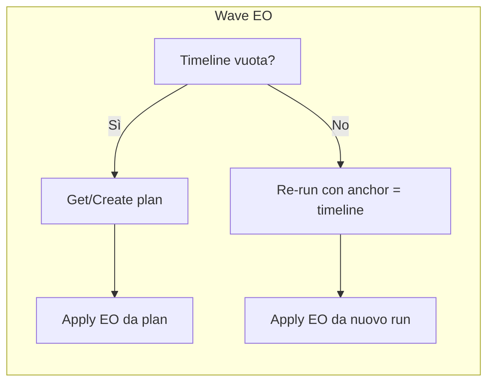
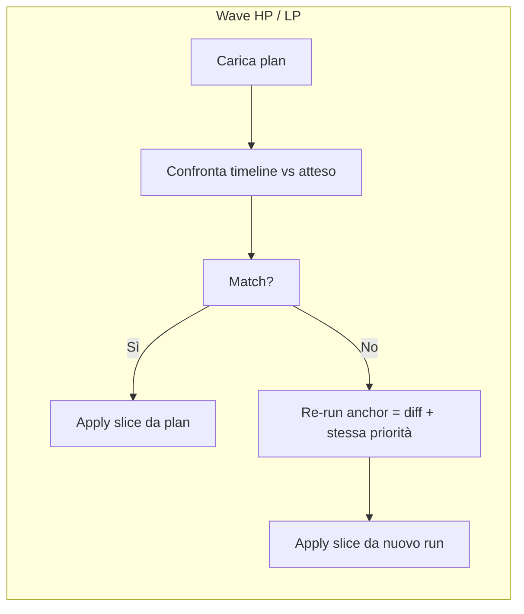

# Piano unificato: Wave assignment (un solve, tre apply) + ordine EO → HP → LP e stati pulsanti

## Obiettivo

- **Nessuna modifica manuale:** output wave identico al run normale tramite un’unica soluzione salvata e tre apply per priorità (EO, HP, LP).
- **Modifiche manuali:** confronto timeline vs piano; solo i task in **diff** (più task della priorità della wave corrente già in timeline) diventano anchor nel re-run.
- **Ordine vincolato:** unica sequenza ammessa EO → HP → LP; UI e backend garantiscono che non si lanci HP senza EO in timeline né LP senza EO+HP.

---

## 1. Persistenza del “piano” optimizer

- **Cosa salvare:** per ogni `work_date`, il `run_id` della soluzione di riferimento (run completo come optimizer normale). Contenuto: `optimizer.optimizer_assignment` per quel `run_id`; priorità (EO/HP/LP) da `daily_containers.priority`.
- **Dove:** nuova tabella (es. `optimizer.optimizer_plan_for_date`) con `work_date` (PK) e `plan_run_id`, oppure colonna su `optimizer.optimizer_run` per marcare il piano per quella data. Preferibile tabella dedicata.
- **Quando aggiornare:** (1) run completo “normale” senza timeline congelata; (2) opzionale: dopo re-run con anchor in wave, aggiornare il piano con il nuovo `run_id`.

Riferimenti: [runAllPhases.ts](server/services/optimizer/runAllPhases.ts), [db.ts](server/services/optimizer/db.ts).

---

## 2. Confronto timeline vs piano (diffs = anchor) e ordine obbligatorio

- **Input:** `work_date`, `plan_run_id`, slice attesa (EO, EO+HP, o EO+HP+LP).
- **Piano (atteso):** da `optimizer_assignment` con `run_id = plan_run_id` + `daily_containers` per priorità, filtrare i task della slice; per ogni task: (task_id, cleaner_id, sequence). Ordinare per cleaner_id, sequence.
- **Timeline (attuale):** da `daily_assignments_current` per `work_date`: (task_id, cleaner_id, sequence).
- **Regola diff:** un task è in **diff** se (cleaner_id o sequence) differisce tra piano e timeline (o è solo in uno dei due).
- **Anchor per re-run (semplificato con ordine EO → HP → LP):** solo (1) **task in diff**, (2) **task della priorità della wave corrente già in timeline**. Non si includono più “priorità successive già in timeline” perché l’ordine obbligatorio garantisce che non ci saranno HP in timeline quando si lancia EO, né LP quando si lancia HP.
- **Output:** `compareTimelineWithPlan(workDate, planRunId, expectedSlice, currentWavePriority)` → `{ match: boolean, anchorTaskIds: number[], anchorByCleaner: ... }` con anchor = diff + task con priorità = currentWavePriority già in timeline.

Implementazione: [runAllPhases.ts](server/services/optimizer/runAllPhases.ts), [timelineContext.ts](server/services/optimizer/timelineContext.ts): costruire `fixedTaskIdsByCleaner` / `timelinePrefixByCleaner` solo per tale sottoinsieme in modalità “wave re-run con anchor”.

---

## 3. Ordine obbligatorio EO → HP → LP e stati pulsanti (UI)

**Regola:** unica sequenza ammessa: prima Wave EO, poi Wave HP, poi Wave LP.

**Stati pulsanti** nella pagina assegnazioni (wave assignment):

| Stato timeline                  | EO            | HP            | LP            |
| ------------------------------- | ------------- | ------------- | ------------- |
| Prima di aver assegnato nulla   | **Abilitato** | Disabilitato  | Disabilitato  |
| Dopo EO (nessun HP in timeline) | Disabilitato  | **Abilitato** | Disabilitato  |
| Dopo EO e HP                    | Disabilitato  | Disabilitato  | **Abilitato** |

**Condizioni booleane** (per `assignButtonDisabled` o equivalente):

- **EO abilitato:** `!hasEoOnTimeline`
- **HP abilitato:** `hasEoOnTimeline && !hasHpOnTimeline`
- **LP abilitato:** `hasEoOnTimeline && hasHpOnTimeline`

`hasEoOnTimeline`, `hasHpOnTimeline`, `hasLpOnTimeline`: derivati da timeline/assignments per la data selezionata (es. `daily_assignments_current` + priorità da `daily_containers` o campo sull’assegnazione). Se i dati non espongono la priorità per i task in timeline, serve un arricchimento (API o join client con containers).

**Dove implementare:**

- **Pulsanti wave:** [client/src/pages/generate-assignments.tsx](client/src/pages/generate-assignments.tsx) (~~2138–2168) passa `assignAction` a `PriorityColumn`. In [client/src/components/drag-drop/priority-column.tsx](client/src/components/drag-drop/priority-column.tsx) (~~277) il pulsante “Assegna a timeline” è disabilitato con `disabled={!assignAction || tasks.length === 0 || isDateInPast || isAssigning}`.
- **Modifica:** in `generate-assignments.tsx` calcolare per la data selezionata `hasEoOnTimeline`, `hasHpOnTimeline`, `hasLpOnTimeline`. Aggiungere prop a `PriorityColumn`, es. `assignButtonDisabled?: boolean`:
  - EO: `assignButtonDisabled = hasEoOnTimeline`
  - HP: `assignButtonDisabled = !hasEoOnTimeline || hasHpOnTimeline`
  - LP: `assignButtonDisabled = !hasEoOnTimeline || !hasHpOnTimeline`
- In `priority-column.tsx`: usare `assignButtonDisabled` nella condizione `disabled` del pulsante (in OR con le condizioni esistenti).

---

## 4. Validazione backend (ordine wave)

- **Endpoint:** `POST /api/optimizer/run-wave` (es. [server/routes.ts](server/routes.ts) ~6773).
- **Prima di eseguire la wave:** per `workDate` determinare quali priorità sono presenti in timeline (query su `daily_assignments_current` + priorità da containers/assegnazioni).
  - Se `priority === 'high_priority'` e in timeline **non** c’è alcun task EO → **400** con messaggio tipo “Esegui prima la wave Early Out”.
  - Se `priority === 'low_priority'` e in timeline **non** ci sono task EO **oppure** non ci sono task HP → **400** con messaggio tipo “Esegui prima le wave Early Out e High Priority”.
- Garantisce l’ordine anche in caso di chiamate API fuori dall’UI.

---

## 5. Aspettative per wave e flusso

- **WAVE EO**
  - **Atteso:** timeline vuota.
  - **Se timeline vuota:** get/create piano; `applyWaveToProduction(workDate, plan_run_id, 'early_out')`. Nessun re-run.
  - **Se timeline non vuota:** tutti i task in timeline sono anchor (con ordine obbligatorio non ci saranno HP/LP; solo EO o mix coerente). Re-run con anchor = timeline; applicare EO dal risultato; opzionale aggiornare piano.
- **WAVE HP**
  - **Atteso:** timeline = task EO come nel piano. Con ordine obbligatorio non ci sono LP in timeline quando si lancia HP.
  - Confronto: `compareTimelineWithPlan(workDate, plan_run_id, 'EO')`. Anchor: diff + task HP già in timeline (solo questi, niente “priorità successive”).
  - **Se match:** `applyWaveToProduction(workDate, plan_run_id, 'high_priority')`.
  - **Se non match:** re-run con anchor = diff + HP già in timeline; apply HP dal nuovo run; opzionale aggiornare piano.
- **WAVE LP**
  - **Atteso:** timeline = EO + HP come nel piano. Anchor: diff + task LP già in timeline.
  - Confronto: `compareTimelineWithPlan(workDate, plan_run_id, 'EO+HP')`.
  - **Se match:** `applyWaveToProduction(workDate, plan_run_id, 'low_priority')`.
  - **Se non match:** re-run con anchor = diff + LP già in timeline; apply LP dal nuovo run; opzionale aggiornare piano.

Wave HP/LP consentite solo se le wave precedenti sono state applicate (garantito da UI e validazione backend).

---

## 6. Apply “fetta” dal piano

- `applyWaveToProduction(workDate, runId, wavePriority)` inserisce in `daily_assignments_current` solo le assegnazioni del `run_id` con `daily_containers.priority = wavePriority`. Quando si applica dal piano usare `plan_run_id`. Verificare che il piano sia valido prima di applicare; se mancante o invalido, eseguire prima run completo e salvare il piano.

---

## 7. Re-run con anchor = diff + stessa priorità già in timeline

- Costruire `timelineSeeds` e `timelinePrefixByCleaner` da: (1) task in diff, (2) task della priorità della wave corrente già in timeline; posizioni da timeline. Solo quei task entrano negli anchor; niente “priorità successive” grazie all’ordine obbligatorio.
- Phase 0: task già in timeline restano esclusi da “unlocked”. Fonte diff: timeline da `daily_assignments_current`; piano da `optimizer_assignment` per `plan_run_id` + `daily_containers`.

---

## 8. Merge mode

- Allineare alla stessa logica: salvare output optimizer normale come piano se non presente. Prima di applicare merge: confrontare timeline con piano; se coincide → applicare nuove assegnazioni dal piano; se c’è diff → re-run con anchor = diff (e stessa priorità già in timeline dove applicabile), poi apply in modalità merge. Confronto + anchor solo diff prima di decidere run completo vs re-run.

---

## 9. Flusso wave (sintesi)

---

## 10. Ordine implementativo

1. **DB:** tabella (o equivalente) `work_date` → `plan_run_id`; salvataggio/lettura piano.
2. **Confronto:** `compareTimelineWithPlan(..., currentWavePriority)` con anchor = **solo** diff + task stessa priorità già in timeline (nessuna “priorità successive”).
3. **Build anchor:** da lista anchor costruire `fixedTaskIdsByCleaner` / `timelinePrefixByCleaner`; integrare in runAllPhases per “wave re-run con anchor”.
4. **Backend ordine:** in `run-wave` validare presenza EO/HP in timeline prima di eseguire HP/LP; ritornare 400 se ordine non rispettato.
5. **Frontend stati pulsanti:** calcolare `hasEoOnTimeline` / `hasHpOnTimeline` / `hasLpOnTimeline`; introdurre `assignButtonDisabled` su `PriorityColumn` e passarla secondo la tabella stati (EO/HP/LP).
6. **Wave EO:** get/create plan; timeline vuota → apply EO da plan; altrimenti re-run con anchor = timeline, apply EO da nuovo run.
7. **Wave HP/LP:** confronto atteso; se match → apply slice da plan; altrimenti re-run con anchor = diff + stessa priorità già in timeline, apply da nuovo run.
8. **Merge mode:** stesso confronto e logica “anchor = diff”; apply come oggi con decisione run completo vs re-run basata sul confronto.
9. **Salvataggio piano:** run completo normale → scrivere `plan_run_id`; re-run con anchor → opzionale aggiornare piano.
10. **Rimozione legacy:** unico flusso attivo “un solve, tre apply” + confronto + anchor da diff/stessa priorità; rimuovere/sostituire costruzione anchor da tutta la timeline e branch deprecati (Phase 1/2/3).

---

## 11. Cose da non fare

- Non considerare tutti i task in timeline come anchor: solo **diff** + **stessa priorità della wave** già in timeline (niente “priorità successive” con ordine obbligatorio).
- Non rieseguire l’optimizer per HP/LP quando la timeline coincide con l’atteso: applicare solo la fetta dal piano.
- Non usare un `run_id` diverso dal piano per l’apply quando non c’è re-run.
- Non lasciare logica deprecata: dopo il refactor, wave e merge usano solo “un solve, tre apply” + confronto + anchor semplificato; rimuovere vecchia implementazione (anchor da tutta la timeline, ottimizzazione per wave separata).
- Non permettere l’esecuzione di HP senza EO in timeline né LP senza EO+HP (blocco in UI e 400 in backend).

