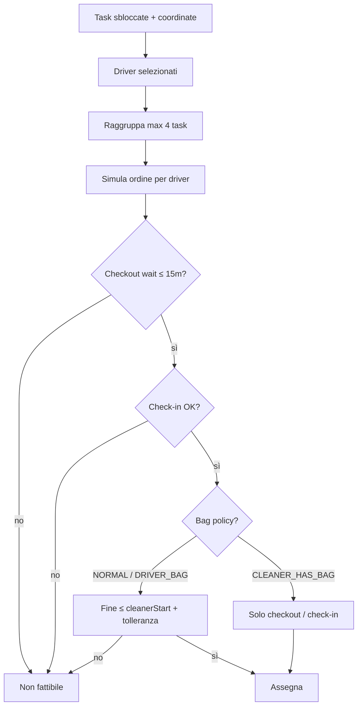

# Vincoli di assegnazione — logistics-optimizer

Documentazione dei vincoli rispettati dal modulo legacy `server/services/logistics-optimizer`.

> Nota: il solver attivo è `logistics-optimizer-final` e usa il modello
> `logistics_task_kind` (`pick-up`, `delivery`, `delivery/pick-up`, `null`).
> I termini `NORMAL_TASK`, `DRIVER_BRINGS_BAG` e `CLEANER_HAS_BAG` qui sotto
> sono mantenuti solo per descrivere il codice legacy.

**Flusso:** Phase 0 (input) → Phase 1 (driver + candidati) → Phase 2 (assegnazione) → Apply (timeline + validazione finale).

---

## 1. Chi entra nell’optimizer

| Vincolo | Dettaglio |
|--------|-----------|
| **Task bloccate** | Escluse in Phase 0 (`locked` su container o `daily_task_locks`). |
| **Coordinate** | Senza `lat`/`lng` valide → escluse dai candidati Phase 1 (non schedulabili). |
| **Driver** | Serve almeno un driver logistica selezionato per la data; altrimenti l’optimizer non parte (`NO_SELECTED_DRIVERS`). |
| **Tipologia logistica** | Nel modello attivo non esclude task: guida finestre e vincoli cleaner (`delivery/pick-up` richiede driver prima del cleaner; `pick-up`, `delivery`, `null` no). |

---

## 2. Regole borsone legacy (`bag-rule`)

Definite in `bag-rule.ts` (`computeBagPolicy`) e mantenute solo per il legacy optimizer.
Nel percorso attivo usare `shared/logistics-task-kind.ts`.

| Tipologia attiva | Condizione |
|--------|--------|
| `null` | Senza cleaner/sequence |
| `delivery/pick-up` | Cleaner presente e (`sequence !== 1` **oppure** premium **oppure** `pax_in > 4`) |
| `pick-up` | Sequence 1, non premium, `pax_in ≤ 4` |
| `delivery` | Solo manuale; dotazione/materiale, non regola borsone |

Mapping legacy indicativo:

| Policy | Quando |
|--------|--------|
| `NORMAL_TASK` | Senza cleaner/sequence, oppure sequence ≠ 1 |
| `DRIVER_BRINGS_BAG` | Sequence 1 + (premium **oppure** `pax_in > 4`) |
| `CLEANER_HAS_BAG` | Sequence 1, non premium, `pax_in ≤ 4` |

Nel modello attivo `requiresDriverBeforeCleaner` vale solo per `delivery/pick-up`.

---

## 3. Vincoli temporali hard (simulazione per driver)

Calcolati da `buildLogisticsScheduleForDriver` in `logistics-driver-schedule.ts`, con costanti in `shared/logistics-scheduling-constraints.ts`.

| Vincolo | Regola |
|--------|--------|
| **Checkout** | Se il checkout vale per `workDate`: arrivo prima del checkout → attesa fino al checkout; **attesa > 15 min** → task non fattibile (`CHECKIN_CHECKOUT_CONSTRAINT`). |
| **Check-in** | Se `checkin_date` = giornata lavoro: **fine task ≤ check-in** e **inizio < check-in** (inizio ≥ check-in → violazione). |
| **Durata servizio** | Ogni task logistica = **15 min** (`LOGISTICS_SERVICE_DURATION_MIN`). |
| **Viaggio** | Stima in auto tra magazzino / task precedente e task successivo; partenza dal depot alla `start_time` del driver. |

---

## 4. Vincolo cleaner / consegna borsone

Implementato in Phase 2 (`getCleanerViolation`).

| Tipologia attiva | Comportamento |
|--------|----------------|
| `delivery/pick-up` | Riferimento: `cleanerTaskStartTime` (o `cleanerStartTime`). Il driver può iniziare il task logistico **dopo** l’inizio HK solo entro tolleranza: **`ceil(2/3 × cleaningTime)`** se durata presente (`lg_containers.cleaning_time`), altrimenti **30 min**. Oltre → `CLEANER_TIME_CONSTRAINT`. I 15 minuti di durata logistica non pesano su questo vincolo: conta l’arrivo/inizio, perché il borsone è disponibile da quel momento. |
| `pick-up` / `delivery` / `null` | **Nessun** vincolo “prima del cleaner”. `pick-up` è solo ritiro sporco; `delivery` è dotazione/materiale manuale. |

**Formula violazione (consegna borsone):**

```
taskStartMin > cleanerStartMin + toleranceMin
```

dove `toleranceMin = ceil(cleaningTime × 2/3)` oppure `30` se `cleaningTime` assente o ≤ 0.

---

## 5. Raggruppamento (Phase 2)

Non sono vincoli di fattibilità per singolo task, ma definiscono i **gruppi** che Phase 2 prova ad assegnare insieme.

| Regola | Valore |
|--------|--------|
| Max task per gruppo | **4** |
| Cluster cleaner — passo tra task consecutivi | ≤ **10 min** |
| Cluster cleaner — raggio dal centroide | ≤ **12 min** |
| Fallback geografico — passo | ≤ **8 min** |
| Fallback geografico — raggio | ≤ **10 min** |
| Singleton premium / pax>4 | Gruppi da 1 task prioritari (`SINGLETON_FALLBACK`) |

**Ordine in coda gruppi:** deadline più stretta → urgenza consegna borsone → tipo gruppo (cluster > geo > singleton) → dimensione gruppo.

**Deadline per priorità** (`getTaskDeadlineMin`):

- `delivery/pick-up`: min tra inizio cleaner e check-in (se applicabile).
- `pick-up`: include anche checkout (se applicabile sulla data).

---

## 6. Assegnazione Phase 2 (logica operativa)

- Solo i **driver selezionati** per la data.
- Ogni gruppo va al driver con simulazione **fattibile** e **score** migliore (prova più permutazioni ordine task nel gruppo).
- Gruppo intero non fattibile → tentativo di **assegnazione parziale** (subset).
- Nessuna soluzione → task in `unassignedTasks` con reason code.

### Reason code

| Codice | Significato |
|--------|-------------|
| `CHECKIN_CHECKOUT_CONSTRAINT` | Violazione check-in o attesa checkout > 15 min |
| `CLEANER_TIME_CONSTRAINT` | Fine task oltre tolleranza rispetto inizio cleaner (borsone) |
| `NO_DRIVER_FEASIBLE` | Nessun driver riesce a inserire il task/gruppo |
| `NO_TASK_CANDIDATES` | Nessun task schedulabile in input |

### Criteri soft (non bloccano)

- Banda geografica lat da Phase 1 (preferenza driver).
- Continuità sequence cleaner nello stesso giro.
- Bilanciamento carico tra driver.
- Compattezza geografica nei gruppi fallback.

---

## 7. Apply (post Phase 2)

File: `index.ts` + `apply-validation.ts`.

- Scrive la timeline logistica; **preserva** task già presenti che l’optimizer non ha rischedulato.
- `recalculateLogisticsTimeline` su tutti i driver.
- **Validazione finale:** se restano violazioni check-in dopo il ricalcolo → **errore** e apply fallisce.
- Attesa checkout > 15 min è tracciata in debug; il throw su apply riguarda principalmente le violazioni check-in.

---

## Schema riepilogativo



---

## File di riferimento

| File | Ruolo |
|------|--------|
| `phase0.ts` | Caricamento task, esclusione locked, `cleaningTime` |
| `phase1.ts` | Driver selezionati, candidati con coordinate, bande lat |
| `phase2.ts` | Raggruppamento, simulazione, vincoli cleaner, assegnazione |
| `bag-rule.ts` | Policy borsone |
| `logistics-driver-schedule.ts` | Motore temporale unico (simulazione + apply) |
| `shared/logistics-scheduling-constraints.ts` | Costanti e regole check-in/checkout |
| `apply-validation.ts` | Validazione timeline finale |
| `index.ts` | Orchestrazione e apply |
